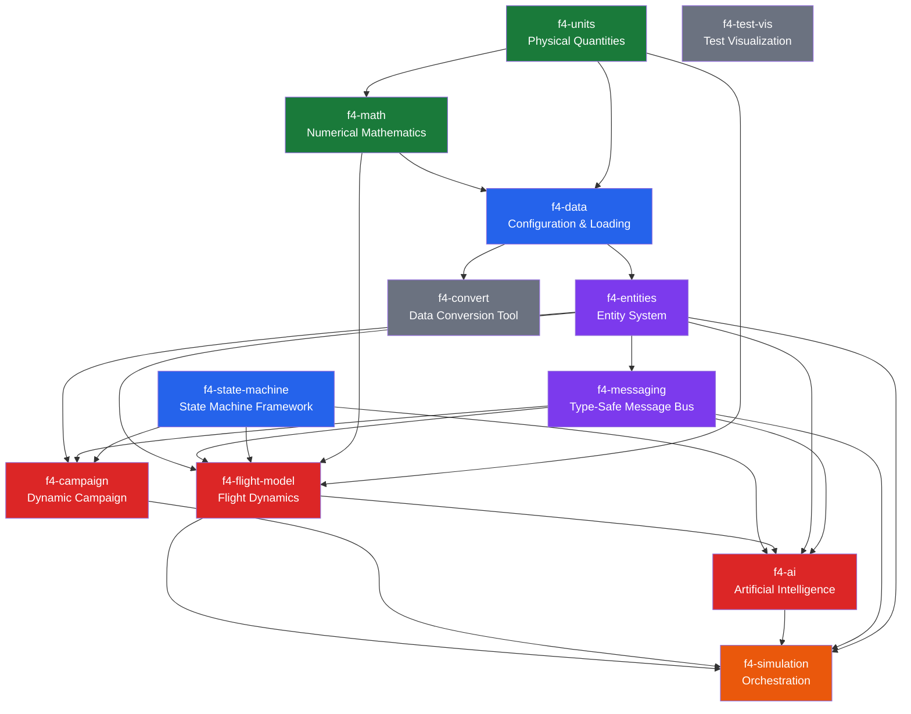
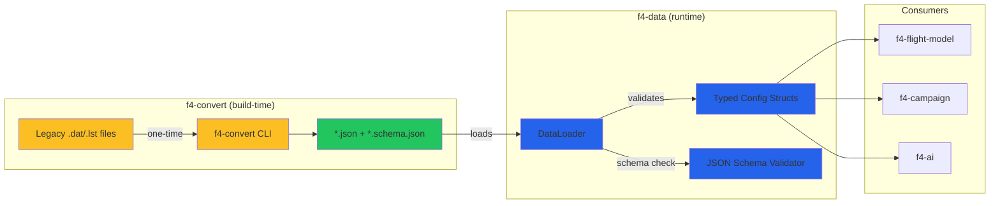
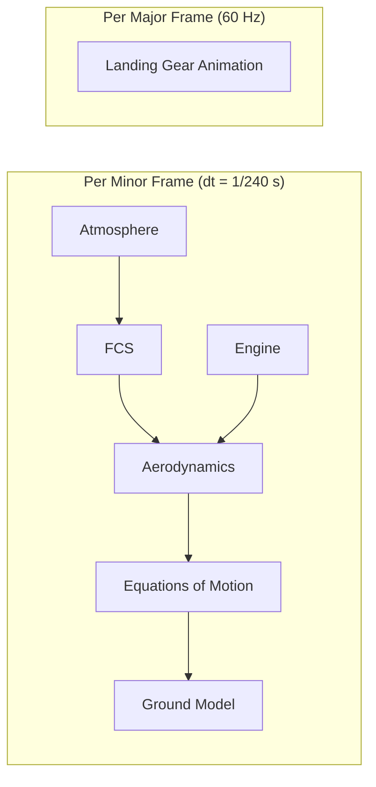
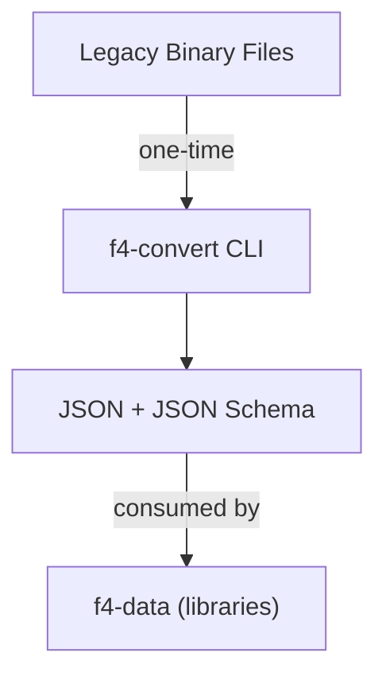
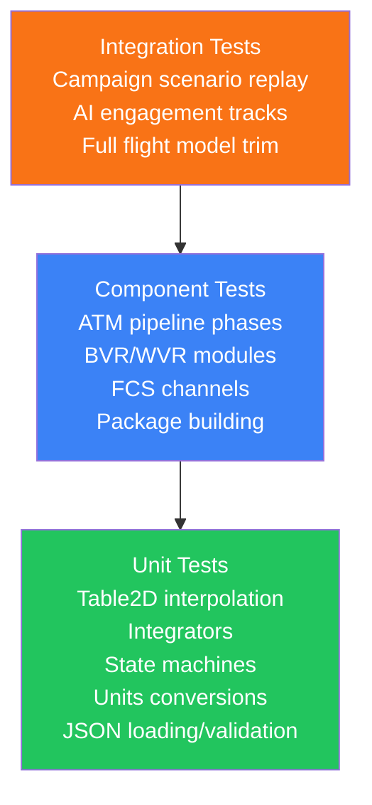
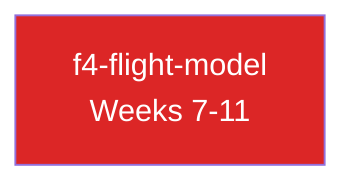
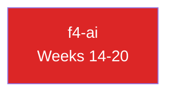
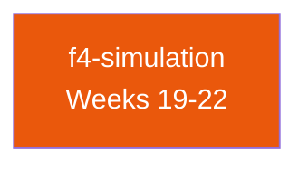

# F4 Modern C++ Libraries — Architecture

> **Status**: Draft — Proposal for community review  
> **Source of Truth**: [FreeFalcon/freefalcon-central](https://github.com/FreeFalcon/freefalcon-central) (develop branch)  
> **Companion**: [FreeFalcon Core Systems Reference](Docs/FreeFalcon_Core_Systems_Reference.html)

---

## Table of Contents

- [1. Introduction & Goals](#1-introduction--goals)
- [2. Design Principles](#2-design-principles)
- [3. Library Overview & Dependency Graph](#3-library-overview--dependency-graph)
- [4. f4-units — Strongly Typed Physical Quantities](#4-f4-units--strongly-typed-physical-quantities)
- [5. f4-math — Numerical Mathematics](#5-f4-math--numerical-mathematics)
- [6. f4-data — Configuration & Data Loading](#6-f4-data--configuration--data-loading)
- [7. f4-state-machine — State Machine Framework](#7-f4-state-machine--state-machine-framework)
- [8. f4-entities — Entity System](#8-f4-entities--entity-system)
- [9. f4-messaging — Type-Safe Message Bus](#9-f4-messaging--type-safe-message-bus)
- [10. f4-flight-model — Flight Dynamics](#10-f4-flight-model--flight-dynamics)
- [11. f4-campaign — Dynamic Campaign](#11-f4-campaign--dynamic-campaign)
- [12. f4-ai — Artificial Intelligence](#12-f4-ai--artificial-intelligence)
- [13. f4-simulation — Orchestration](#13-f4-simulation--orchestration)
- [14. f4-convert — Data Conversion Tool](#14-f4-convert--data-conversion-tool)
- [15. f4-test-vis — Test Visualization Support](#15-f4-test-vis--test-visualization-support)
- [16. Testing Strategy](#16-testing-strategy)
- [17. Implementation Roadmap](#17-implementation-roadmap)

---

## 1. Introduction & Goals

The FreeFalcon project is a campaign-based, multiplayer, open-source flight simulator descended from Falcon 4.0. Its C++ codebase (~500K+ lines) was written in the late 1990s using Watcom C/C++ V10 and has been maintained with Microsoft Visual Studio since. While functionally rich, the architecture reflects the constraints and conventions of its era: monolithic classes, enum-driven switch statements, raw memory management, opaque binary data formats, and deep inheritance hierarchies with minimal use of modern abstraction patterns.

This document proposes a ground-up reimplementation of FreeFalcon's three core subsystems — **campaign**, **flight model**, and **AI** — as a set of independent, modern C++ (20/23) libraries. The goals are:

1. **Engine-agnostic**: No dependency on DirectX, the original UI toolkit, or any specific rendering pipeline. These libraries compute simulation state; how that state is rendered is a separate concern.
2. **Testable in isolation**: Each library can be compiled, linked, and unit-tested without any of the others. The flight model can be tested with synthetic data and no campaign. The campaign can run headless with no flight model.
3. **Data-format-independent**: Original binary `.dat` files are translated once to open formats (JSON) by a separate conversion tool. The libraries never see the legacy formats.
4. **Type-safe at compile time**: Physical quantities carry their units. Message types are distinct types, not enum tags in a switch. State machines are data structures, not scattered switch blocks.
5. **Preserve functionality, not code**: The FreeFalcon source is the behavioral reference. Every feature documented in the Core Systems Reference must be reproducible, but the implementation is free to use entirely different architectures.

### Scope

This effort covers the systems documented in the companion [Core Systems Reference](Docs/FreeFalcon_Core_Systems_Reference.html):

| System | Original Location | Lines (approx) | Key Complexity |
|--------|-------------------|-----------------|----------------|
| Campaign | `src/campaign/` | ~30,000 | Request→queue→fulfill pipeline, A* pathfinding, 41 mission types, package building |
| Flight Model | `src/sim/airframe/` | ~8,000 | 6-DOF aero, gain-scheduled FCS, quaternion EOM, engine spool, stall state machine |
| AI | `src/sim/digi/` + `src/sim/hdigi/` | ~20,000 | 24-mode state machine, BVR/WVR tactics, sensor fusion, 4778-line landing system |

Explicitly **out of scope**: graphics rendering, UI, sound, networking, input handling, and the cockpit/instrumentation systems.

---

## 2. Design Principles

### 2.1 Composition Over Inheritance

The original code uses deep inheritance (`VuEntity → FalconEntity → SimBaseClass → SimMoverClass → SimVehicleClass → AircraftClass`). Each level adds data and virtual methods, producing god-classes with 200+ member variables. The replacement uses **composition**: an entity is a lightweight handle that aggregates typed components. Behavior comes from systems that operate on components, not from virtual method overrides on a class hierarchy.

### 2.2 Data-Driven, Not Code-Driven

The original encodes behavioral variation in `switch` statements over enums — `switch(MissionType)`, `switch(DigiMode)`, `switch(stallState)`. The replacement encodes behavioral variation in **data** (polymorphic configurations, strategy objects, transition tables) that can be loaded, inspected, and tested independently of the code that interprets them.

### 2.3 Explicit is Better Than Implicit

The original code relies heavily on implicit conventions: float parameters with implied units (feet? meters? radians? degrees?), global singletons accessed via `extern`, bit-packed schedule arrays, and 500-element flat structs indexed by magic offsets. The replacement makes everything explicit: units in the type system, named fields, dependency injection, and validated configuration.

### 2.4 Zero-Cost Abstractions

All abstractions must resolve to code that is at least as fast as the original at runtime. Template-based unit types, `constexpr` configuration, and inline table lookups ensure there is no performance penalty for type safety or architectural cleanliness.

### 2.5 Separation of Pipeline Stages

The original often interleaves concerns — `AirframeClass::Exec()` runs atmosphere, FCS, aero, engine, and EOM in a fixed-order loop with no way to inspect, reorder, or profile individual stages. The replacement makes each pipeline stage a named, composable unit with clear input/output contracts.

---

## 3. Library Overview & Dependency Graph



### Library Summary

| Library | Role | C++ Standard | Dependencies |
|---------|------|-------------|--------------|
| `f4-units` | Compile-time physical quantity types | C++20 | None |
| `f4-math` | Tables, interpolation, integration, filtering, solvers | C++20 | f4-units |
| `f4-data` | JSON/TOML config loading, validation, schema | C++20 | f4-math, f4-units |
| `f4-state-machine` | Type-safe state machines with transition tables | C++20 | None |
| `f4-entities` | Component-based entity handles, tags, spatial index | C++20 | f4-data, f4-math |
| `f4-messaging` | Typed message bus with thread-safe queues | C++20 | f4-entities |
| `f4-flight-model` | Atmosphere, aero, FCS, engine, EOM, ground model | C++20 | f4-math, f4-units, f4-state-machine, f4-entities, f4-messaging |
| `f4-campaign` | ATM, GTM, packages, squadrons, route planning | C++20 | f4-math, f4-entities, f4-messaging, f4-state-machine |
| `f4-ai` | DigitalBrain, BVR/WVR, sensors, navigation, landing | C++20 | f4-flight-model, f4-entities, f4-messaging, f4-state-machine |
| `f4-simulation` | Time management, threading, main loop orchestration | C++20 | All above |
| `f4-convert` | CLI tool: legacy binary → JSON conversion | C++17 | f4-data (for schema emission) |
| `f4-test-vis` | Test trace recording and HTML/SVG visualization | C++20 | f4-math, f4-entities |

### Color Legend
- 🟢 **Foundation** — zero domain coupling, independently testable
- 🔵 **Infrastructure** — domain-aware but not domain-specific
- 🟣 **Core** — entity and messaging backbone
- 🔴 **Domain** — campaign, flight model, AI
- 🟠 **Orchestration** — ties everything together
- ⚪ **Tooling** — build-time and test-time support

---

## 4. f4-units — Strongly Typed Physical Quantities

### 4.1 Motivation

The original codebase is a sea of raw `float` values with implied units. Altitude is in feet, speed in knots or feet-per-second depending on context, pressure in psf, angles in radians for math but degrees for configuration, mass in pounds or slugs interchangeably. Unit conversion bugs are a constant source of defects — the original code has multiple conversion functions (`FeetToMeters`, `KnotsToFPS`, `CelsiusToFahrenheit`, `PsiToInHg`, etc.) scattered across files, and it is not always clear which one to call.

The `f4-units` library eliminates this class of bugs entirely by making units part of the type system. Adding a length to a speed is a compile-time error. Converting between units is explicit and always correct.

### 4.2 Design

The library defines a `Quantity` class template parameterized on a dimension tag and a unit tag. Arithmetic operations between quantities of the same dimension are allowed (with automatic unit conversion where the ratio is known). Cross-dimension arithmetic is forbidden.

```cpp
// f4-units/quantity.hpp
#pragma once
#include <cstdint>
#include <compare>
#include <ostream>
#include <cmath>

namespace f4::units {

// --- Dimension tags (zero-cost type markers) ---
struct Length     {};
struct Speed     {};
struct Time      {};
struct Mass      {};
struct Force     {};
struct Pressure  {};
struct Temperature {};
struct Angle     {};
struct Area      {};
struct Volume    {};
struct Frequency {};
struct MassFlow  {};
struct Power     {};

// --- Unit tags with conversion ratios to a reference unit ---
// Reference for Length: meters
struct Meters    { static constexpr double ratio = 1.0; };
struct Feet      { static constexpr double ratio = 0.3048; };
struct NauticalMiles { static constexpr double ratio = 1852.0; };
struct Kilometers { static constexpr double ratio = 1000.0; };

// Reference for Speed: m/s
struct MetersPerSec   { static constexpr double ratio = 1.0; };
struct Knots          { static constexpr double ratio = 0.514444; };
struct FeetPerSec     { static constexpr double ratio = 0.3048; };

// Reference for Pressure: Pa
struct Pascals    { static constexpr double ratio = 1.0; };
struct PSF        { static constexpr double ratio = 47.8803; };
struct PSI        { static constexpr double ratio = 6894.76; };
struct InHg       { static constexpr double ratio = 3386.39; };
struct Millibars  { static constexpr double ratio = 100.0; };

// Reference for Temperature: Kelvin
struct Kelvin     {
    static constexpr double to_ref(double v) { return v; }
    static constexpr double from_ref(double v) { return v; }
};
struct Celsius    {
    static constexpr double to_ref(double v) { return v + 273.15; }
    static constexpr double from_ref(double v) { return v - 273.15; }
};
struct Rankine    {
    static constexpr double to_ref(double v) { return v * 5.0 / 9.0; }
    static constexpr double from_ref(double v) { return v * 9.0 / 5.0; }
};

// Reference for Angle: radians
struct Radians    { static constexpr double ratio = 1.0; };
struct Degrees    { static constexpr double ratio = 0.017453292519943295; };
struct Mils       { static constexpr double ratio = 0.00098174770424681; };

// Reference for Mass: kg
struct Kilograms  { static constexpr double ratio = 1.0; };
struct Pounds     { static constexpr double ratio = 0.453592; };
struct Slugs      { static constexpr double ratio = 14.5939; };

// Reference for Time: seconds
struct Seconds    { static constexpr double ratio = 1.0; };
struct Milliseconds { static constexpr double ratio = 0.001; };
struct Minutes    { static constexpr double ratio = 60.0; };
struct Hours      { static constexpr double ratio = 3600.0; };

// Reference for MassFlow: kg/s
struct KgPerSec  { static constexpr double ratio = 1.0; };
struct LbsPerSec { static constexpr double ratio = 0.453592; };
struct LbsPerHr  { static constexpr double ratio = 0.000125998; };

// --- Primary quantity template ---
template<typename DimTag, typename UnitTag, typename Rep = double>
class Quantity {
    Rep value_in_unit_;

    // Convert from the given unit to the reference unit of this dimension
    static constexpr Rep to_ref(Rep v) {
        if constexpr (requires { UnitTag::to_ref(v); }) {
            return static_cast<Rep>(UnitTag::to_ref(v));
        } else {
            return v * static_cast<Rep>(UnitTag::ratio);
        }
    }
    static constexpr Rep from_ref(Rep v) {
        if constexpr (requires { UnitTag::from_ref(v); }) {
            return static_cast<Rep>(UnitTag::from_ref(v));
        } else {
            return v / static_cast<Rep>(UnitTag::ratio);
        }
    }

    // Internal constructor from reference-unit value
    struct FromRef {};
    constexpr Quantity(Rep ref_value, FromRef) : value_in_unit_(from_ref(ref_value)) {}

public:
    using dimension_type = DimTag;
    using unit_type     = UnitTag;
    using rep_type      = Rep;

    constexpr explicit Quantity(Rep v) : value_in_unit_(v) {}
    constexpr Quantity() : value_in_unit_(0) {}

    // Value in this quantity's native unit
    [[nodiscard]] constexpr Rep value() const noexcept { return value_in_unit_; }

    // Value in reference unit
    [[nodiscard]] constexpr Rep ref_value() const noexcept { return to_ref(value_in_unit_); }

    // Convert to same dimension, different unit
    template<typename OtherUnit>
    [[nodiscard]] constexpr Quantity<DimTag, OtherUnit, Rep> in() const noexcept {
        return Quantity<DimTag, OtherUnit, Rep>(from_ref(to_ref(value_in_unit_)));
    }

    // --- Arithmetic (same dimension, same or different unit) ---
    template<typename OtherUnit>
    constexpr auto operator+(const Quantity<DimTag, OtherUnit, Rep>& rhs) const {
        return Quantity<DimTag, UnitTag, Rep>(
            value_in_unit_ + rhs.template in<UnitTag>().value());
    }
    template<typename OtherUnit>
    constexpr auto operator-(const Quantity<DimTag, OtherUnit, Rep>& rhs) const {
        return Quantity<DimTag, UnitTag, Rep>(
            value_in_unit_ - rhs.template in<UnitTag>().value());
    }
    constexpr auto operator-() const {
        return Quantity<DimTag, UnitTag, Rep>(-value_in_unit_);
    }
    template<typename OtherUnit>
    constexpr auto operator*(const Quantity<DimTag, OtherUnit, Rep>& rhs) const {
        // Same-dimension multiplication is a bug — use scalar multiply instead
        static_assert(sizeof(OtherUnit) == 0, "Cannot multiply two quantities of the same dimension");
    }
    // Scalar multiply/divide
    constexpr auto operator*(Rep s) const {
        return Quantity<DimTag, UnitTag, Rep>(value_in_unit_ * s);
    }
    constexpr auto operator/(Rep s) const {
        return Quantity<DimTag, UnitTag, Rep>(value_in_unit_ / s);
    }

    // --- Comparison (same dimension, any unit) ---
    template<typename OtherUnit>
    constexpr auto operator<=>(const Quantity<DimTag, OtherUnit, Rep>& rhs) const {
        return to_ref(value_in_unit_) <=> rhs.to_ref(rhs.value_in_unit_);
    }
    template<typename OtherUnit>
    constexpr bool operator==(const Quantity<DimTag, OtherUnit, Rep>& rhs) const {
        return to_ref(value_in_unit_) == rhs.to_ref(rhs.value_in_unit_);
    }
};

// Scalar * Quantity
template<typename Dim, typename Unit, typename Rep>
constexpr auto operator*(Rep s, const Quantity<Dim, Unit, Rep>& q) {
    return q * s;
}

// --- Dimension-bridging operators (e.g., Speed * Time = Length) ---
template<typename D1, typename U1, typename D2, typename U2, typename R>
auto operator*(const Quantity<D1, U1, R>& a, const Quantity<D2, U2, R>& b)
    -> Quantity</* derived dimension */, /* derived unit */, R>;
// (Specializations provided for the specific cross-dimension products needed)

// --- Convenience aliases ---
using Meters_t    = Quantity<Length, Meters>;
using Feet_t      = Quantity<Length, Feet>;
using NM_t        = Quantity<Length, NauticalMiles>;

using MetersPerSec_t = Quantity<Speed, MetersPerSec>;
using Knots_t        = Quantity<Speed, Knots>;
using FeetPerSec_t   = Quantity<Speed, FeetPerSec>;

using Pascals_t   = Quantity<Pressure, Pascals>;
using PSF_t       = Quantity<Pressure, PSF>;
using PSI_t       = Quantity<Pressure, PSI>;
using InHg_t      = Quantity<Pressure, InHg>;

using Kelvin_t    = Quantity<Temperature, Kelvin>;
using Celsius_t   = Quantity<Temperature, Celsius>;

using Radians_t   = Quantity<Angle, Radians>;
using Degrees_t   = Quantity<Angle, Degrees>;

using Kilograms_t = Quantity<Mass, Kilograms>;
using Pounds_t    = Quantity<Mass, Pounds>;

using Seconds_t   = Quantity<Time, Seconds>;
using Hours_t     = Quantity<Time, Hours>;

using KgPerSec_t  = Quantity<MassFlow, KgPerSec>;
using LbsPerHr_t  = Quantity<MassFlow, LbsPerHr>;

// --- Dimension-bridging specializations ---
// Speed * Time = Length
// Implemented via a custom multiply that returns the correct Quantity type.

} // namespace f4::units
```

### 4.3 Derived Quantities

Some quantities are derived from others and carry dependency context. The most important is **Mach number**, which depends on local speed of sound, which depends on temperature, which depends on altitude:

```cpp
// f4-units/derived.hpp
namespace f4::units {

// Speed of sound: a = sqrt(theta) * 1116.45 ft/s  (where theta = T/T0)
inline FeetPerSec_t speed_of_sound(Kelvin_t temperature) {
    // ISA sea-level: T0 = 288.15 K, a0 = 1116.45 ft/s
    constexpr double T0 = 288.15;
    constexpr double a0_fps = 1116.45;
    double theta = temperature.value() / T0;
    return FeetPerSec_t(a0_fps * std::sqrt(theta));
}

// Mach = true_airspeed / speed_of_sound
inline double mach_number(FeetPerSec_t tas, Kelvin_t temperature) {
    return tas.value() / speed_of_sound(temperature).value();
}

// Dynamic pressure: q_bar = 0.5 * rho * V^2
inline PSF_t dynamic_pressure(FeetPerSec_t tas, Kelvin_t temperature, Feet_t altitude) {
    // rho from ISA atmosphere (simplified — full model lives in f4-flight-model)
    constexpr double rho0 = 0.002377; // slugs/ft^3 at sea level
    constexpr double T0 = 288.15;
    constexpr double L = 0.000006875; // troposphere lapse rate, per foot
    double h = altitude.in<Feet>().value();
    double rho = (h < 36089.0)
        ? rho0 * std::pow(1.0 - L * h / T0, 4.256)
        : rho0 * 0.2971; // simplified stratosphere
    double v = tas.value();
    return PSF_t(0.5 * rho * v * v);
}

// Wing loading: W/S
inline PSF_t wing_loading(Pounds_t weight, SquareFeet_t wing_area) {
    return PSF_t(weight.in<Pounds>().value() / wing_area.value());
}

} // namespace f4::units
```

### 4.4 Usage Example

```cpp
using namespace f4::units;

// Construction — explicit from numeric value
Feet_t altitude = Feet_t(25000.0);
Knots_t speed    = Knots_t(450.0);
Celsius_t temp   = Celsius_t(-40.0);

// Conversion — explicit, never implicit
auto alt_m   = altitude.in<Meters>();       // Meters_t
auto speed_fps = speed.in<FeetPerSec>();    // FeetPerSec_t

// Arithmetic — same dimension, any unit (auto-converts)
Feet_t new_alt = altitude + Feet_t(500.0);  // OK
Feet_t new_alt2 = altitude + Meters_t(152.4); // OK — Meters auto-converted to Feet

// Mach number — derived from context
auto sos = speed_of_sound(Kelvin_t(temp.in<Kelvin>().value()));
double mach = mach_number(speed.in<FeetPerSec>(), Kelvin_t(temp.in<Kelvin>().value()));

// Compile errors:
// Feet_t bad = altitude + speed;         // error: different dimensions
// double bad2 = altitude;                 // error: explicit conversion required
// auto bad3 = altitude.in<Pounds>();      // error: Pounds is not a Length unit
```

---

## 5. f4-math — Numerical Mathematics

### 5.1 Motivation

The original codebase uses at least five distinct numerical methods, each implemented inline with raw arrays and magic indices:

- **Adams-Bashforth 4-point** — FCS integral terms (pitch alpha path, yaw integrals)
- **Tustin (bilinear) 7-term** — alpha integration in pitch FCS
- **Forward Euler** — position integration in equations of motion
- **First-order exponential lag** — turbulence smoothing (FLTust), engine RPM spool
- **Newton-Raphson** — trim solver (2-axis), CAS inverse (pitot equation)

Additionally, the aerodynamic and engine models depend heavily on **2D table lookups** (Mach × angle-of-attack) with bilinear interpolation, implemented as raw arrays indexed by hand-computed offsets.

`f4-math` provides a unified, type-safe, generic library for all of these, parameterized on the value type so it works seamlessly with the unit types from `f4-units`.

### 5.2 Lookup Tables

```cpp
// f4-math/table.hpp
#pragma once
#include <vector>
#include <array>
#include <algorithm>
#include <stdexcept>
#include <cmath>

namespace f4::math {

enum class BoundaryMode {
    Clamp,       // clamp query to table bounds
    Extrapolate, // linear extrapolation beyond bounds
    Error        // throw std::out_of_range
};

/// 1D lookup table with linear interpolation.
template<typename X, typename Y>
class Table1D {
    std::vector<X> x_;
    std::vector<Y> y_;
    BoundaryMode mode_ = BoundaryMode::Clamp;

public:
    Table1D() = default;
    Table1D(std::vector<X> x, std::vector<Y> y, BoundaryMode mode = BoundaryMode::Clamp)
        : x_(std::move(x)), y_(std::move(y)), mode_(mode) {
        if (x_.size() != y_.size() || x_.size() < 2)
            throw std::invalid_argument("Table1D: x and y must have same size >= 2");
    }

    [[nodiscard]] Y lookup(X query) const {
        // Find bracketing interval
        auto it = std::upper_bound(x_.begin(), x_.end(), query);
        if (it == x_.begin()) {
            if (mode_ == BoundaryMode::Error) throw std::out_of_range("Table1D: below lower bound");
            return y_.front(); // Clamp
        }
        if (it == x_.end()) {
            if (mode_ == BoundaryMode::Error) throw std::out_of_range("Table1D: above upper bound");
            return y_.back(); // Clamp
        }
        size_t hi = static_cast<size_t>(it - x_.begin());
        size_t lo = hi - 1;
        double t = static_cast<double>(query - x_[lo]) / static_cast<double>(x_[hi] - x_[lo]);
        return y_[lo] + t * (y_[hi] - y_[lo]);
    }

    [[nodiscard]] size_t size() const { return x_.size(); }
    [[nodiscard]] const std::vector<X>& x_values() const { return x_; }
    [[nodiscard]] const std::vector<Y>& y_values() const { return y_; }
};

/// 2D lookup table with bilinear interpolation.
/// Row axis (e.g., Mach) and column axis (e.g., alpha).
template<typename RowX, typename ColX, typename Z>
class Table2D {
    std::vector<RowX> rows_;
    std::vector<ColX> cols_;
    std::vector<std::vector<Z>> data_;  // data_[row][col]
    BoundaryMode mode_ = BoundaryMode::Clamp;

public:
    Table2D() = default;
    Table2D(
        std::vector<RowX> rows,
        std::vector<ColX> cols,
        std::vector<std::vector<Z>> data,
        BoundaryMode mode = BoundaryMode::Clamp
    ) : rows_(std::move(rows)), cols_(std::move(cols)), data_(std::move(data)), mode_(mode) {
        if (data_.size() != rows_.size())
            throw std::invalid_argument("Table2D: row count mismatch");
        for (auto& row : data_)
            if (row.size() != cols_.size())
                throw std::invalid_argument("Table2D: column count mismatch");
    }

    [[nodiscard]] Z lookup(RowX row_query, ColX col_query) const {
        // Bilinear: find the 4 corner points and interpolate
        auto clamp_idx = [this](auto& axis, const auto& query) -> size_t {
            auto it = std::upper_bound(axis.begin(), axis.end(), query);
            if (it == axis.begin()) return 0;
            if (it == axis.end()) return axis.size() - 2;
            return static_cast<size_t>(it - axis.begin()) - 1;
        };

        size_t r0 = clamp_idx(rows_, row_query);
        size_t c0 = clamp_idx(cols_, col_query);
        size_t r1 = std::min(r0 + 1, rows_.size() - 1);
        size_t c1 = std::min(c0 + 1, cols_.size() - 1);

        double tr = (rows_[r1] == rows_[r0]) ? 0.0
            : static_cast<double>(row_query - rows_[r0]) / static_cast<double>(rows_[r1] - rows_[r0]);
        double tc = (cols_[c1] == cols_[c0]) ? 0.0
            : static_cast<double>(col_query - cols_[c0]) / static_cast<double>(cols_[c1] - cols_[c0]);

        Z z00 = data_[r0][c0], z10 = data_[r1][c0];
        Z z01 = data_[r0][c1], z11 = data_[r1][c1];
        return z00 * (1-tr)*(1-tc) + z10 * tr*(1-tc)
             + z01 * (1-tr)*tc    + z11 * tr*tc;
    }

    [[nodiscard]] size_t num_rows() const { return rows_.size(); }
    [[nodiscard]] size_t num_cols() const { return cols_.size(); }
    [[nodiscard]] const std::vector<RowX>& row_values() const { return rows_; }
    [[nodiscard]] const std::vector<ColX>& col_values() const { return cols_; }
};

} // namespace f4::math
```

**Usage with aero data:**

```cpp
// CL as a function of (Mach, alpha_degrees)
Table2D<double, double, double> CL_table(
    /* rows: Mach   */ {0.0, 0.3, 0.6, 0.8, 1.0, 1.2, 1.5, 2.0},
    /* cols: alpha   */ {-4.0, -2.0, 0.0, 2.0, 4.0, 8.0, 12.0, 16.0, 20.0},
    /* CL values    */ {
        {0.05, 0.10, 0.15, 0.20, 0.25, 0.35, 0.45, 0.50, 0.48},  // M=0.0
        {0.05, 0.10, 0.15, 0.20, 0.26, 0.38, 0.50, 0.55, 0.50},  // M=0.3
        // ... more rows
    },
    BoundaryMode::Clamp
);

double cl = CL_table.lookup(0.8, 8.0);  // bilinear interpolation
```

### 5.3 Integrators

```cpp
// f4-math/integration.hpp
#pragma once
#include <vector>
#include <concepts>
#include <functional>

namespace f4::math {

/// Concept: a state type that supports addition and scalar multiplication
template<typename T>
concept IntegrableState = requires(T a, T b, double s) {
    { a + b } -> std::convertible_to<T>;
    { a * s } -> std::convertible_to<T>;
};

/// Concept: a derivative function f(state) -> derivative
/// The derivative must be of the same type as the state (or compatible).

/// Forward Euler integrator.
template<IntegrableState State>
class EulerIntegrator {
    State state_{};

public:
    explicit EulerIntegrator(State initial = State{}) : state_(std::move(initial)) {}

    /// Advance state by dt using derivative function.
    template<typename DerivFn>
    const State& step(DerivFn&& f, double dt) {
        state_ = state_ + f(state_) * dt;
        return state_;
    }

    [[nodiscard]] const State& state() const noexcept { return state_; }
    void reset(State s) { state_ = std::move(s); }
};

/// Adams-Bashforth 4-point integrator.
/// Stores the last 4 derivative samples. Falls back to Euler for the first 3 steps.
template<IntegrableState State>
class AdamsBashforth4 {
    State state_{};
    std::array<State, 4> history_{};  // last 4 derivatives
    size_t count_ = 0;

public:
    explicit AdamsBashforth4(State initial = State{}) : state_(std::move(initial)) {}

    template<typename DerivFn>
    const State& step(DerivFn&& f, double dt) {
        State deriv = f(state_);

        if (count_ < 3) {
            // Bootstrap with Euler
            state_ = state_ + deriv * dt;
        } else {
            // Shift history, insert newest
            for (int i = 0; i < 3; ++i) history_[i] = history_[i + 1];
            history_[3] = deriv;
            // AB4 coefficients: (55, -59, 37, -9) / 24
            state_ = state_ + (history_[3] * (55.0/24.0)
                              + history_[2] * (-59.0/24.0)
                              + history_[1] * (37.0/24.0)
                              + history_[0] * (-9.0/24.0)) * dt;
        }
        if (count_ < 4) ++count_;
        return state_;
    }

    [[nodiscard]] const State& state() const noexcept { return state_; }
    void reset(State s) { state_ = std::move(s); count_ = 0; }
};

/// Runge-Kutta 4th order integrator.
template<IntegrableState State>
class RK4Integrator {
    State state_{};

public:
    explicit RK4Integrator(State initial = State{}) : state_(std::move(initial)) {}

    template<typename DerivFn>
    const State& step(DerivFn&& f, double dt) {
        auto k1 = f(state_);
        auto k2 = f(state_ + k1 * (dt / 2.0));
        auto k3 = f(state_ + k2 * (dt / 2.0));
        auto k4 = f(state_ + k3 * dt);
        state_ = state_ + (k1 + k2 * 2.0 + k3 * 2.0 + k4) * (dt / 6.0);
        return state_;
    }

    [[nodiscard]] const State& state() const noexcept { return state_; }
    void reset(State s) { state_ = std::move(s); }
};

} // namespace f4::math
```

### 5.4 Filters

```cpp
// f4-math/filters.hpp
#pragma once
#include <cmath>

namespace f4::math {

/// First-order exponential lag: y[n] = y[n-1] + (x - y[n-1]) * (1 - exp(-dt/tau))
/// Used for: turbulence smoothing (FLTust), engine RPM spool, sensor noise filtering.
template<typename T>
class FirstOrderLag {
    T state_{};
    double tau_ = 1.0;   // time constant in seconds
    bool initialized_ = false;

public:
    FirstOrderLag(T initial = T{}, double tau = 1.0)
        : state_(std::move(initial)), tau_(tau) {}

    T update(T input, double dt) {
        double alpha = (tau_ > 0.0) ? 1.0 - std::exp(-dt / tau_) : 1.0;
        if (!initialized_) {
            state_ = input;
            initialized_ = true;
        } else {
            state_ = state_ + (input - state_) * alpha;
        }
        return state_;
    }

    [[nodiscard]] const T& state() const noexcept { return state_; }
    void set_tau(double tau) { tau_ = tau; }
    void reset(T s) { state_ = std::move(s); initialized_ = false; }
};

/// Rate limiter: output changes by at most max_rate * dt per step.
template<typename T>
class RateLimiter {
    T state_{};
    double max_rate_ = 1.0;  // units of T per second

public:
    RateLimiter(T initial = T{}, double max_rate = 1.0)
        : state_(std::move(initial)), max_rate_(max_rate) {}

    T update(T input, double dt) {
        T max_delta = static_cast<T>(max_rate_ * dt);
        if (input > state_ + max_delta)      return state_ = state_ + max_delta;
        else if (input < state_ - max_delta) return state_ = state_ - max_delta;
        else                                  return state_ = input;
    }

    [[nodiscard]] const T& state() const noexcept { return state_; }
    void set_max_rate(double r) { max_rate_ = r; }
};

/// Deadband: output is zero when |input| < threshold.
template<typename T>
class Deadband {
    T threshold_{};

public:
    explicit Deadband(T threshold) : threshold_(threshold) {}

    T apply(T input) const {
        if (input > threshold_)       return input - threshold_;
        else if (input < -threshold_) return input + threshold_;
        else                          return T{};
    }
};

} // namespace f4::math
```

### 5.5 Newton-Raphson Solver

```cpp
// f4-math/solvers.hpp
#pragma once
#include <cmath>
#include <functional>
#include <optional>

namespace f4::math {

/// Newton-Raphson root finder.
/// Used for: trim solver (find alpha, throttle for equilibrium),
///          CAS inverse (isentropic pitot equation).
struct NewtonRaphsonResult {
    double root;
    int iterations;
    bool converged;
};

inline NewtonRaphsonResult newton_raphson(
    std::function<double(double)> f,
    std::function<double(double)> df,
    double initial_guess,
    double tolerance = 1e-8,
    int max_iterations = 20
) {
    double x = initial_guess;
    bool converged = false;
    int iters = 0;
    for (int i = 0; i < max_iterations; ++i) {
        double fx = f(x);
        double dfx = df(x);
        if (std::abs(dfx) < 1e-15) break;  // avoid division by zero
        double dx = fx / dfx;
        x -= dx;
        ++iters;
        if (std::abs(dx) < tolerance) { converged = true; break; }
    }
    return {x, iters, converged};
}

} // namespace f4::math
```

---

## 6. f4-data — Configuration & Data Loading

### 6.1 Motivation

The original code loads configuration from multiple sources: binary `.dat` files per aircraft type, a hardcoded `MissionData[]` array in `mission.cpp`, dozens of global `g_b*`/`g_f*`/`g_n*` tuning variables, and the massive flat `AuxAeroData` struct with 500 unnamed float fields. There is no validation — if a data file is corrupt or a field is out of range, the simulator silently produces wrong results.

`f4-data` provides a single, validated, typed configuration loading system. All data lives in open formats (JSON) with accompanying JSON Schemas. The libraries never see the legacy binary formats — those are handled by the separate `f4-convert` tool.

### 6.2 Architecture



### 6.3 Data File Structure

```
data/
├── aircraft/
│   ├── f16c.json            # Aircraft performance data
│   ├── f16c.schema.json     # Schema for validation
│   ├── f15e.json
│   ├── f15e.schema.json
│   ├── ...                  # One JSON + schema per aircraft type
│   └── _types/              # Shared sub-schemas
│       ├── aero_table.schema.json
│       ├── engine_table.schema.json
│       └── weapon_station.schema.json
├── weapons/
│   ├── aim120c.json
│   ├── aim120c.schema.json
│   └── ...
├── vehicles/
│   └── ...
├── mission_types.json          # 41 mission type definitions
├── mission_types.schema.json
├── tuning_parameters.json      # All g_* tuning variables, named and documented
├── tuning_parameters.schema.json
├── formation_types.json        # 16 formation definitions
└── ai_profiles.json            # Skill level profiles (Recruit through Ace)
```

### 6.4 Aircraft Data Example

The original `AuxAeroData` is a 500-element `float[]`. The replacement is a named, typed, validated JSON structure:

## 7. f4-state-machine — State Machine Framework

### 7.1 Motivation

The original codebase has state machines implemented as enum-plus-switch in at least six places:

| State Machine | States | Location | Triggered By |
|--------------|--------|----------|-------------|
| AI Mode (DigiMode) | 24 modes | `digi.h` | Target detection, orders, fuel, threats |
| Stall | 6 states | `eom.cpp` | AoA exceedance, recovery commands |
| ATC/Landing | 17 landing + 11 takeoff | `digi_landme.cpp` (4778 lines) | ATC messages, position, stabilization checks |
| Air Refueling | 5 states | `digi_refuel.cpp` | Tanker proximity, boom contact |
| Engine | 3 states | `engine.cpp` | Throttle input, start command |
| Waypoint Progress | 4+ states | `digi_waypoint.cpp` | Distance to waypoint, station time |

Each implementation is a `switch(current_state)` with manual `current_state = newState` assignments, duplicated guard logic, no enforcement of valid transitions, and no way to inspect the machine structure without reading the entire function.

### 7.2 Design

```cpp
// f4-state-machine/fsm.hpp
#pragma once
#include <functional>
#include <string_view>
#include <unordered_map>
#include <vector>
#include <optional>
#include <stdexcept>

namespace f4::fsm {

/// Transition: (current_state, event) -> {guard?, action?, next_state}
template<typename StateEnum, typename EventVariant>
struct Transition {
    StateEnum from;
    StateEnum to;
    EventVariant event;
    std::function<bool()> guard;      // optional: return false to reject
    std::function<void()> action;      // optional: side effect on transition
};

/// A state machine defined by its transition table.
template<typename StateEnum, typename EventVariant>
class StateMachine {
public:
    using TransitionType = Transition<StateEnum, EventVariant>;

    class Builder {
        std::vector<TransitionType> transitions_;
        StateEnum initial_{};
    public:
        Builder& initial(StateEnum s) { initial_ = s; return *this; }
        Builder& on(StateEnum from, StateEnum to, EventVariant event,
                     std::function<void()> action = {},
                     std::function<bool()> guard = {}) {
            transitions_.push_back({from, to, event, std::move(guard), std::move(action)});
            return *this;
        }
        StateMachine build() { return StateMachine(initial_, std::move(transitions_)); }
    };

    /// Process an event. Returns the new state.
    StateEnum process(const EventVariant& event) {
        for (auto& t : transitions_) {
            if (t.from != current_) continue;
            if (t.event != event) continue;
            if (t.guard && !t.guard()) continue;
            current_ = t.to;
            if (t.action) t.action();
            return current_;
        }
        return current_;  // no matching transition
    }

    [[nodiscard]] StateEnum current() const noexcept { return current_; }
    [[nodiscard]] const std::vector<TransitionType>& transitions() const { return transitions_; }
    [[nodiscard]] bool can_transition(StateEnum to, const EventVariant& event) const {
        for (auto& t : transitions_) {
            if (t.from == current_ && t.to == to && t.event == event) {
                return !t.guard || t.guard();
            }
        }
        return false;
    }

private:
    explicit StateMachine(StateEnum initial, std::vector<TransitionType> transitions)
        : current_(initial), transitions_(std::move(transitions)) {}
    StateEnum current_;
    std::vector<TransitionType> transitions_;
};

} // namespace f4::fsm
```

### 7.3 Example: Stall State Machine

```cpp
// Replacing the 6-state stall machine from eom.cpp
enum class StallState { None, EnteringDeepStall, DeepStall, Spinning, FlatSpin, Recovering };
enum class StallEvent { AoAExceed, TimerExpired, RecoveryAttempt, Recovered,
                         SpinDetected, AsymmetryDetected };

using StallSM = f4::fsm::StateMachine<StallState, StallEvent>;

StallSM make_stall_machine() {
    return StallSM::Builder()
        .initial(StallState::None)
        .on(StallState::None, StallState::EnteringDeepStall, StallEvent::AoAExceed)
        .on(StallState::EnteringDeepStall, StallState::DeepStall, StallEvent::TimerExpired)
        .on(StallState::DeepStall, StallState::Spinning, StallEvent::SpinDetected)
        .on(StallState::DeepStall, StallState::FlatSpin, StallEvent::AsymmetryDetected)
        .on(StallState::Spinning, StallState::Recovering, StallEvent::RecoveryAttempt)
        .on(StallState::FlatSpin, StallState::Recovering, StallEvent::RecoveryAttempt)
        .on(StallState::Recovering, StallState::None, StallEvent::Recovered)
        .build();
}

// Usage:
auto stall_sm = make_stall_machine();
stall_sm.process(StallEvent::AoAExceed);
assert(stall_sm.current() == StallState::EnteringDeepStall);
```

### 7.4 Layered State Machines (AI Mode Priority)

The AI's 24 DigiMode values are organized in a **priority ladder** — higher-priority modes preempt lower ones. This maps to a layered design where each layer is an independent state machine, and the active mode is the highest-priority non-idle layer:

```cpp
// Each layer has an idle state. The effective mode is the highest-priority
// non-idle layer. This replaces the 24-value DigiMode enum + priority
// interrupt logic scattered across dlogic.cpp.
template<typename ModeEnum, typename EventVariant>
class LayeredStateMachine {
    struct Layer {
        int priority;
        ModeEnum idle_state;
        StateMachine<ModeEnum, EventVariant> sm;
    };
    std::vector<Layer> layers_;

public:
    ModeEnum effective_mode() const {
        for (auto& layer : layers_) {
            if (layer.sm.current() != layer.idle_state)
                return layer.sm.current();
        }
        return layers_.back().idle_state;
    }

    void process(const EventVariant& event) {
        for (auto& layer : layers_)
            layer.sm.process(event);
    }
};
```

---

## 8. f4-entities — Entity System

### 8.1 Motivation

The original uses deep inheritance (`VuEntity -> FalconEntity -> SimBaseClass -> SimMoverClass -> SimVehicleClass -> AircraftClass`) with `dynamic_cast` for type queries. Each level adds member variables, producing god-classes with 200+ members. There is no way to add or remove capabilities at runtime (e.g., an aircraft deaggregating from a campaign entity into a sim entity).

The replacement uses **entity-component** architecture: an entity is a lightweight ID handle, and behavior/data lives in typed **components** that can be added, removed, and queried independently. **Systems** (not virtual methods) operate on entities that have the components they require.

### 8.2 Design

```cpp
// f4-entities/entity.hpp
#pragma once
#include <cstdint>
#include <functional>
#include <typeindex>
#include <unordered_map>
#include <unordered_set>
#include <memory>
#include <vector>
#include <string>
#include <stdexcept>
#include <optional>

namespace f4::entities {

/// Unique entity identifier (64-bit: generation counter + index)
struct EntityId {
    uint64_t value = 0;
    [[nodiscard]] bool valid() const noexcept { return value != 0; }
    explicit operator bool() const noexcept { return valid(); }
    auto operator<=>(const EntityId&) const = default;
};

// --- Tag System ---

struct TagKey {
    std::string name;
    auto operator<=>(const TagKey&) const = default;
};

struct TagValue {
    enum Type { String, Int, Float, Bool } type;
    std::string str_val;
    int64_t int_val = 0;
    double float_val = 0.0;
    bool bool_val = false;
    // constructors, type-checked getters...
};

using TagSet = std::unordered_map<TagKey, TagValue>;

namespace tags {
    inline constexpr const char* ROLE        = "role";       // "fighter", "bomber", "tanker", "awacs"
    inline constexpr const char* TEAM        = "team";       // "red", "blue"
    inline constexpr const char* DOMAIN      = "domain";     // "air", "ground", "naval"
    inline constexpr const char* STEALTH     = "stealth";    // bool
    inline constexpr const char* ALIVE       = "alive";      // bool
}

// --- Component System ---

struct ComponentBase {
    virtual ~ComponentBase() = default;
    virtual std::type_index type_id() const = 0;
};

template<typename Derived>
struct Component : ComponentBase {
    std::type_index type_id() const override { return std::type_index(typeid(Derived)); }
};

// --- Core Components ---

/// Spatial position, orientation, velocity in the world
struct TransformComponent : Component<TransformComponent> {
    double x = 0, y = 0, z = 0;                      // position (feet, z-up)
    double qw = 1, qx = 0, qy = 0, qz = 0;          // orientation quaternion
    double vx = 0, vy = 0, vz = 0;                   // velocity (ft/s, world frame)
    double p = 0, q = 0, r = 0;                      // body rates (rad/s)
};

/// Campaign identity — links a sim entity to its campaign-level identity
struct CampaignIdentityComponent : Component<CampaignIdentityComponent> {
    EntityId campaign_entity;
    int team_id = 0;
    std::string unit_type_name;     // e.g., "F-16C_50"
};

// --- Entity Handle ---

class EntityWorld; // forward decl

class EntityHandle {
    EntityId id_;
    EntityWorld* world_ = nullptr;
public:
    EntityHandle() = default;
    EntityHandle(EntityId id, EntityWorld* world) : id_(id), world_(world) {}
    [[nodiscard]] bool valid() const;
    [[nodiscard]] EntityId id() const noexcept { return id_; }
    template<typename T> T* get() const;
    template<typename T> T& require() const;
    template<typename T> bool has() const;
    template<typename T, typename... Args> T& add(Args&&... args);
    template<typename T> void remove();
    void set_tag(const TagKey& key, TagValue value);
    std::optional<TagValue> get_tag(const TagKey& key) const;
    bool has_tag(const TagKey& key) const;
};

// --- Entity World ---

class EntityWorld {
    struct EntityRecord {
        TagSet tags;
        std::unordered_map<std::type_index, std::unique_ptr<ComponentBase>> components;
        uint32_t generation = 0;
        bool alive = true;
    };
    std::vector<EntityRecord> entities_;
    std::vector<uint32_t> free_list_;
    uint64_t next_id_ = 1;

public:
    EntityHandle create();
    void destroy(EntityId id);
    std::vector<EntityHandle> query(std::function<bool(const TagSet&)> pred) const;
    template<typename T> std::vector<EntityHandle> with_component() const;
    std::vector<EntityHandle> with_tag(const TagKey& key, const TagValue& value) const;
    std::vector<EntityHandle> within_radius(double cx, double cy, double cz,
                                             double radius) const;

private:
    friend class EntityHandle;
    EntityRecord* get_record(EntityId id);
};

} // namespace f4::entities
```

### 8.3 Spatial Indexing

```cpp
// f4-entities/spatial_index.hpp
namespace f4::entities {

/// 3D spatial hash grid for fast range queries.
/// Cell size ~ query radius for best performance.
class SpatialIndex {
    struct Cell { std::vector<EntityId> entities; };
    double cell_size_;
    std::unordered_map<int64_t, Cell> grid_;

    int64_t to_key(double x, double y, double z) const;
public:
    explicit SpatialIndex(double cell_size = 5000.0) : cell_size_(cell_size) {}
    void insert(EntityId id, double x, double y, double z);
    void remove(EntityId id);
    void update(EntityId id, double x, double y, double z);
    std::vector<EntityId> query_radius(double cx, double cy, double cz,
                                        double radius) const;
    std::optional<EntityId> nearest(double cx, double cy, double cz) const;
};

} // namespace f4::entities
```

---

## 9. f4-messaging — Type-Safe Message Bus

### 9.1 Motivation

The original has 76+ message types, each a class inheriting from `FalconEvent -> VuMessage`, with `#pragma pack(1)` DATA_BLOCKs, manual `Encode`/`Decode`, and routing via `switch(FalconMsgID)`. The wingman radio alone has 50+ message types in `wingradio.cpp`.

The replacement: **plain data structs** as messages, **type-erased handlers** in a hash map, **explicit thread boundaries** via queued buses.

### 9.2 Design

```cpp
// f4-messaging/bus.hpp
#pragma once
#include <functional>
#include <unordered_map>
#include <typeindex>
#include <mutex>
#include <queue>
#include <vector>
#include <atomic>
#include <condition_variable>

namespace f4::messaging {

// Messages are plain structs — no inheritance required.
struct DamageMessage {
    uint64_t target_id, source_id;
    int damage_type = 0;
    float strength = 0.0f;
};

struct MissileFireMessage {
    uint64_t shooter_id, missile_id, target_id;
    int weapon_type = 0;
};

struct WingmanCommandMessage {
    uint64_t sender_id, receiver_id;
    int command_type = 0;
    uint64_t target_id = 0;
};

struct MissionRequestMessage {
    int mission_type = 0;
    uint64_t requester_id = 0;
    double target_x = 0, target_y = 0, target_z = 0;
    int priority = 0;
};

/// Thread-safe message queue per type.
template<typename Msg>
class MessageQueue {
    std::queue<Msg> queue_;
    mutable std::mutex mutex_;
public:
    void push(Msg msg) {
        std::lock_guard lock(mutex_);
        queue_.push(std::move(msg));
    }
    std::vector<Msg> drain() {
        std::vector<Msg> batch;
        std::lock_guard lock(mutex_);
        while (!queue_.empty()) {
            batch.push_back(std::move(queue_.front()));
            queue_.pop();
        }
        return batch;
    }
};

/// Message bus: type-indexed handler dispatch with cross-thread queuing.
class MessageBus {
    using HandlerFn = std::function<void(const void*)>;
    std::unordered_map<std::type_index, std::vector<HandlerFn>> handlers_;
    std::mutex pending_mutex_;
    std::vector<std::function<void()>> pending_;

public:
    /// Register a handler for a specific message type.
    template<typename Msg>
    void subscribe(std::function<void(const Msg&)> handler) {
        auto wrapped = [h = std::move(handler)](const void* raw) {
            h(*static_cast<const Msg*>(raw));
        };
        handlers_[std::type_index(typeid(Msg))].push_back(std::move(wrapped));
    }

    /// Publish immediately (same-thread).
    template<typename Msg>
    void publish(const Msg& msg) {
        auto it = handlers_.find(std::type_index(typeid(Msg)));
        if (it != handlers_.end())
            for (auto& h : it->second) h(&msg);
    }

    /// Queue for deferred delivery on another thread.
    template<typename Msg>
    void publish_deferred(Msg msg) {
        std::lock_guard lock(pending_mutex_);
        auto& list = handlers_[std::type_index(typeid(Msg))];
        for (auto& h : list) {
            auto m = msg;
            auto fn = h;
            pending_.push_back([m = std::move(m), fn]() { fn(&m); });
        }
    }

    /// Deliver all pending messages. Call from the owning thread.
    void flush_pending() {
        std::vector<std::function<void()>> to_flush;
        {
            std::lock_guard lock(pending_mutex_);
            std::swap(to_flush, pending_);
        }
        for (auto& fn : to_flush) fn();
    }

    /// Send to another thread's bus.
    template<typename Msg>
    void send_to(MessageBus& target, const Msg& msg) {
        target.publish_deferred(msg);
    }
};

} // namespace f4::messaging
```

### 9.3 Thread Architecture

```cpp
// Each subsystem has its own bus:
struct SimulationThreads {
    f4::messaging::MessageBus sim_bus;       // flight model, AI, physics
    f4::messaging::MessageBus campaign_bus;  // ATM, GTM, supply

    // Cross-thread: campaign sends mission assignment to sim
    template<typename Msg>
    void send_campaign_to_sim(const Msg& msg) {
        campaign_bus.send_to(sim_bus, msg);
    }

    // Each thread calls flush_pending() at the start of its update:
    void sim_thread_tick() {
        sim_bus.flush_pending();
        // ... run sim update ...
    }
    void campaign_thread_tick() {
        campaign_bus.flush_pending();
        // ... run campaign update ...
    }
};
```
---

## 10. f4-flight-model — Flight Dynamics

### 10.1 Motivation

The flight model is the most self-contained domain system. It has a clear pipeline: atmosphere -> FCS -> aero -> engine -> EOM, executed at 240 Hz (4 minor frames per major frame at 60 Hz). The original `AirframeClass` is a 200+ member god-class with ~3000 lines across implementation files. The simplified AI model (SuperSimple) is interleaved via `IsSet(Simplified)` checks throughout.

### 10.2 Pipeline Architecture



### 10.3 Fidelity Strategy

The original has two code paths (`IsSet(Simplified)`) scattered throughout. The replacement uses the **Strategy pattern** to make fidelity a first-class, swappable choice:

```cpp
// f4-flight-model/strategy.hpp
namespace f4::flight {

struct ControlInput {
    double pitch_stick = 0.0;   // -1.0 to 1.0
    double roll_stick  = 0.0;   // -1.0 to 1.0
    double yaw_pedal   = 0.0;   // unclamped
    double throttle    = 0.0;   // 0.0 (idle) to 1.5 (afterburner)
    bool speed_brake   = false;
    bool gear_command  = false;
    bool hook_command  = false;
};

struct AeroState {
    double x, y, z;             // world position (feet)
    double qw, qx, qy, qz;     // orientation quaternion
    double vx, vy, vz;         // world-frame velocity (ft/s)
    double p, q, r;             // body rates (rad/s)
    double alpha = 0, beta = 0; // angles of attack/sideslip (rad)
    double mach = 0, cas = 0, tas = 0;
    double qbar = 0;            // dynamic pressure (psf)
    double altitude_msl = 0, altitude_agl = 0;
    double fx = 0, fy = 0, fz = 0;      // body forces (lbs)
    double l_moment = 0, m_moment = 0, n_moment = 0;
    double thrust_lbs = 0, fuel_remaining_lbs = 0, rpm_percent = 0;
    double nz = 1.0, g_load = 1.0;
    bool on_ground = false, gear_down = false, stalled = false;
};

/// Abstract flight model strategy.
class IFlightModel {
public:
    virtual ~IFlightModel() = default;
    virtual void initialize(const data::AircraftConfig& config) = 0;
    virtual void set_state(const AeroState& state) = 0;
    virtual const AeroState& step(const ControlInput& input, double dt) = 0;
    virtual const AeroState& state() const = 0;
    virtual std::optional<AeroState> trim(
        double altitude_ft, double speed_kts,
        double throttle_setting = 0.0) = 0;
};

/// Full 6-DOF flight model (player / nearby AI).
class FullFlightModel : public IFlightModel {
    // Composes: AtmosphereModel, FlightControlSystem,
    //           AerodynamicModel, EngineModel, EquationsOfMotion, StallStateMachine
};

/// Simplified flight model (distant AI, campaign-level).
/// Direct alpha computation, 75% drag reduction, no FCS.
class SimplifiedFlightModel : public IFlightModel {
    // Nz from flight path + stick, alpha from Nz/(qbar*S*CN_alpha)
};

/// Null flight model for headless campaign testing.
class NullFlightModel : public IFlightModel {
    AeroState state_{};
public:
    void initialize(const data::AircraftConfig&) override {}
    void set_state(const AeroState& s) override { state_ = s; }
    const AeroState& step(const ControlInput&, double) override { return state_; }
    const AeroState& state() const override { return state_; }
    std::optional<AeroState> trim(double, double, double) override { return state_; }
};

} // namespace f4::flight
```

### 10.4 Composed Internal Structure

The full flight model breaks `AirframeClass`'s 200+ members into focused, composable classes:

```cpp
// f4-flight-model/atmosphere.hpp
namespace f4::flight {

/// ISA atmosphere model (3-layer: troposphere, lower/upper stratosphere)
class AtmosphereModel {
public:
    struct Output {
        double temperature_K;
        double pressure_psf;
        double density_slugs_ft3;
        double speed_of_sound_fps;
    };
    Output compute(double altitude_ft) const;
    double compute_mach(double tas_fps, double altitude_ft) const;
    double compute_cas(double mach, double altitude_ft) const; // Newton-Raphson inverse
};

// f4-flight-model/fcs.hpp

/// Flight Control System — gain-scheduled autopilot.
/// Input: pilot stick/pedal/throttle, current aero state.
/// Output: commanded alpha, roll rate, beta, and throttle.
class FlightControlSystem {
public:
    struct Output {
        double commanded_alpha;     // rad
        double commanded_roll_rate; // rad/s
        double commanded_beta;      // rad
        double commanded_throttle;  // 0.0-1.5
    };
    void initialize(const data::FCSConfig& cfg, const data::AircraftConfig& ac);
    Output step(const ControlInput& input, const AeroState& state, double dt);

private:
    // Pitch channel: PI controller with Adams-Bashforth integration.
    // Two modes: AOA-command (F-16 style) or G-command.
    struct PitchChannel {
        double max_aoa = 0.436;   // 25 deg
        double g_limit_pos = 9.0, g_limit_neg = -3.0;
        double time_constant = 0.12;
        f4::math::AdamsBashforth4<double> integrator;
    } pitch_;

    // Roll channel: rate-command with Q-bar scheduled time constant.
    struct RollChannel {
        double max_rate = 4.19;   // 240 deg/s
        f4::math::Table2D<double, double, double> time_constant_table;
    } roll_;

    // Yaw channel: PI controller on Ny error.
    struct YawChannel {
        double max_beta = 0.14;   // 8 deg
        f4::math::AdamsBashforth4<double> integrator;
    } yaw_;
};

// f4-flight-model/aerodynamics.hpp

/// Aerodynamic force computation.
/// Input: alpha, beta, mach, qbar, configuration.
/// Output: CL, CD, CY, and body-frame forces/moments.
class AerodynamicModel {
public:
    struct Output {
        double CL, CD, CY, Cm, Cl, Cn;
        double fx, fy, fz, l_m, m_m, n_m;
    };
    void initialize(const data::AircraftConfig& config);
    Output compute(double alpha, double beta, double mach, double qbar,
                   bool gear_down, const std::vector<int>& stores_drag) const;
private:
    f4::math::Table2D<double, double, double> CL_table_, CD_table_, CY_table_;
    double ground_effect_factor(double altitude_agl) const;
    double stores_drag_coefficient(double mach, const std::vector<int>& stores) const;
    double lift_curve_slope(double mach) const; // central difference
};

// f4-flight-model/engine.hpp

/// Engine model: thrust + RPM spool + fuel consumption.
class IEngineModel {
public:
    virtual ~IEngineModel() = default;
    virtual void initialize(const data::EngineConfig& config) = 0;
    virtual double compute_thrust(double alt_ft, double mach,
                                  double throttle, double dt) = 0;
    virtual double compute_fuel_flow(double alt_ft, double mach,
                                     double throttle) const = 0;
    virtual double rpm_percent() const = 0;
};

class SingleEngineModel : public IEngineModel {
    f4::math::Table2D<double, double, double> thrust_idle_, thrust_mil_, thrust_ab_;
    f4::math::Table2D<double, double, double> fuel_idle_, fuel_mil_, fuel_ab_;
    f4::math::FirstOrderLag<double> rpm_lag_;  // RPM spool model
};

/// Multi-engine composes N SingleEngineModel instances.
/// Eliminates the 1172-line code duplication in the original.
class MultiEngineModel : public IEngineModel {
    std::vector<std::unique_ptr<IEngineModel>> engines_;
};

// f4-flight-model/eom.hpp

/// Equations of Motion: quaternion kinematics + force integration.
class EquationsOfMotion {
public:
    void step(AeroState& state,
              const AerodynamicModel::Output& aero,
              double thrust, double dt);
private:
    void quaternion_kinematics(AeroState& state, double dt);
    void integrate_velocity(AeroState& state,
                            const AerodynamicModel::Output& aero,
                            double thrust, double dt);
    class GroundModel {
        double spring_constant_ = 50000.0;
        double damping_constant_ = 10000.0;
    public:
        void apply(AeroState& state, double dt);
    } ground_;
};

} // namespace f4::flight
```

### 10.5 Full Pipeline Integration

```cpp
// f4-flight-model/full_model.hpp
namespace f4::flight {

class FullFlightModel : public IFlightModel {
public:
    void initialize(const data::AircraftConfig& config) override {
        aero_.initialize(config);
        fcs_.initialize(config.fcs, config);
        engine_ = std::make_unique<SingleEngineModel>();
        engine_->initialize(config.engine);
        stall_sm_ = make_stall_machine();
    }

    const AeroState& step(const ControlInput& input, double dt) override {
        // 1. Atmosphere
        auto atmo = atmosphere_.compute(state_.altitude_msl);
        state_.mach = atmo.speed_of_sound_fps > 0
            ? state_.tas / atmo.speed_of_sound_fps : 0;
        state_.qbar = 0.5 * atmo.density_slugs_ft3 * state_.tas * state_.tas;

        // 2. Stall state machine
        // stall_sm_.process(/* events from alpha, rate, etc. */);

        // 3. Flight Control System
        auto fcs_out = fcs_.step(input, state_, dt);

        // 4. Aerodynamics
        auto aero_out = aero_.compute(
            state_.alpha, state_.beta, state_.mach, state_.qbar,
            state_.gear_down, stores_drag_);

        // 5. Engine
        state_.thrust_lbs = engine_->compute_thrust(
            state_.altitude_msl, state_.mach, fcs_out.commanded_throttle, dt);
        state_.fuel_remaining_lbs -= engine_->compute_fuel_flow(
            state_.altitude_msl, state_.mach, fcs_out.commanded_throttle) * dt / 3600.0;

        // 6. Equations of Motion
        eom_.step(state_, aero_out, state_.thrust_lbs, dt);

        return state_;
    }

private:
    AeroState state_{};
    AtmosphereModel atmosphere_;
    FlightControlSystem fcs_;
    AerodynamicModel aero_;
    std::unique_ptr<IEngineModel> engine_;
    EquationsOfMotion eom_;
    f4::fsm::StateMachine<StallState, StallEvent> stall_sm_;
    std::vector<int> stores_drag_;
};

} // namespace f4::flight
```
---

## 11. f4-campaign — Dynamic Campaign

### 11.1 Motivation

The campaign system implements a request→queue→fulfill pipeline driven by the Air Tasking Manager (ATM). Mission requests are generated by various subsystems, prioritized, deconflicted, and fulfilled by building packages (multi-flight strike groups). Route planning uses A* pathfinding on pre-computed threat maps. The Ground Tasking Manager (GTM) manages ground unit assignments in parallel.

The original ATM is a monolithic `Task()` method with a 200ms time budget, inline budget checks, and deeply nested conditionals. Mission types are selected via a 41-case `switch(MissionType)`.

### 11.2 Mission Configuration — Data-Driven, Not Switch-Driven

```cpp
// f4-campaign/mission_config.hpp
namespace f4::campaign {

enum class MissionType : int {
    BARCAP, BARCAP2, HAVCAP, TARCAP, RESCAP, AMBUSHCAP, SWEEP, ALERT, INTERCEPT, ESCORT,
    OCASTRIKE, INTSTRIKE, STRIKE, DEEPSTRIKE, STSTRIKE, SEADSTRIKE,
    ONCALLCAS, PRPLANCAS, CAS, SAD, INT, BAI,
    STRATBOMB, AWACS, JSTAR, TANKER, ECM, RECON, BDA, FAC, SAR, AIRLIFT, ASW, ASHIP
};

/// Mission behavior flags — loaded from JSON, control package building.
/// Replaces the 10+ flag bitfields per mission type in the original.
struct MissionFlags {
    bool add_awacs = false, add_tanker = false, add_ecm = false;
    bool add_bda = false, add_sead = false, add_escort = false;
    bool add_bar_cap = false, avoid_threat = false, high_threat = false;
    bool no_target_abort = false, expect_divert = false, always_fly = false;
    bool stealth_required = false;
};

/// Mission profile — loaded from JSON, fully specifies a mission type's behavior.
/// Replaces the MissionData[] array and eliminates the switch(MissionType).
struct MissionProfile {
    MissionType type;
    std::string name;
    std::string target_category;    // "air", "ground", "naval", "support"
    double min_altitude_ft = 0, max_altitude_ft = 0;
    double mission_altitude_ft = 0;
    double loiter_time_sec = 0;
    int min_aircraft = 2, max_aircraft = 4;
    double min_strength = 0, max_strength = 0;
    MissionFlags flags;
    std::string default_loadout;
};

std::vector<MissionProfile> load_mission_profiles(const std::filesystem::path& json_path);

} // namespace f4::campaign
```

### 11.3 ATM Pipeline

```cpp
// f4-campaign/atm.hpp
namespace f4::campaign {

struct MissionRequest {
    uint64_t id = 0;
    MissionType type;
    double target_x = 0, target_y = 0;
    uint64_t target_entity = 0;
    int priority = 0;
    int context_code = 0;       // e.g., "enemyUnitAdvanceBridge"
    bool is_part_of_action = false;
    double creation_time = 0;
};

struct Package {
    uint64_t id = 0;
    MissionType mission_type;
    std::vector<uint64_t> flight_ids;
    std::vector<uint64_t> target_ids;
    double target_x = 0, target_y = 0;
    int priority = 0;
    std::string status;  // "building", "ready", "in_flight", "complete"
};

/// Tasking pipeline phase interface.
/// Each phase is a composable unit that can be profiled, tested, and reordered.
class ITaskingPhase {
public:
    virtual ~ITaskingPhase() = default;
    virtual std::string name() const = 0;
    virtual void execute(TaskingContext& ctx) = 0;
};

struct TaskingContext {
    std::vector<MissionRequest>& pending_requests;
    std::vector<Package>& active_packages;
    std::vector<MissionRequest>& delayed_requests;
    entities::EntityWorld& world;
    double current_time = 0;
    double budget_remaining_ms = 200.0;
    bool budget_exceeded() const { return budget_remaining_ms <= 0; }
};

/// The Air Tasking Manager — composes pipeline phases.
class AirTaskingManager {
public:
    void initialize(const std::vector<MissionProfile>& profiles,
                    entities::EntityWorld& world);
    void submit_request(MissionRequest request);
    int task(double current_time);  // returns packages built this cycle
    void set_phases(std::vector<std::unique_ptr<ITaskingPhase>> phases);

private:
    std::vector<std::unique_ptr<ITaskingPhase>> phases_;
    std::vector<MissionRequest> pending_;
    std::vector<Package> packages_;
    std::vector<MissionRequest> delayed_;
    entities::EntityWorld* world_ = nullptr;
};

// Concrete pipeline phases:
class RequestGenerationPhase  : public ITaskingPhase { /* auto OCA/ASHIP/AIRLIFT */ };
class PrioritizationPhase     : public ITaskingPhase { /* sort by priority, tempo adjust */ };
class DeconflictionPhase      : public ITaskingPhase { /* check active packages */ };
class PackageBuildingPhase    : public ITaskingPhase { /* target analysis, threat, flights */ };
class SupportAssignmentPhase : public ITaskingPhase { /* SEAD, escort, tanker, AWACS */ };
class RoutePlanningPhase     : public ITaskingPhase { /* A* pathfinding, waypoints */ };
class LoadoutSelectionPhase  : public ITaskingPhase { /* weapon selection by mission */ };

} // namespace f4::campaign
```

### 11.4 Threat Map and A* Pathfinding

```cpp
// f4-campaign/threat_map.hpp
namespace f4::campaign {

/// Altitude-banded threat map for route planning.
/// Replaces the duplicated SamMapData / RadarMapData from the original.
template<typename CellType = double, size_t NumBands = 4>
class ThreatMap {
public:
    struct AltitudeBand {
        double min_alt_ft, max_alt_ft;
        std::string name;  // "Low", "Medium", "High", "Very High"
    };

    ThreatMap(double grid_spacing_ft, double x_min, double y_min,
              size_t x_cells, size_t y_cells,
              std::array<AltitudeBand, NumBands> bands);

    void update(const entities::EntityWorld& world);
    CellType sample(double x, double y, double altitude_ft) const;
    double path_cost(double x, double y, double altitude_ft) const;
    const std::vector<CellType>& grid(size_t band) const; // for visualization

private:
    std::array<std::vector<CellType>, NumBands> grids_;
    /// Original weighting formulas:
    /// Low:    SAM_low*28 + SAM_high*2 + 10
    /// Medium: SAM_low*10 + SAM_high*23
    /// High:   SAM_high*30
    /// V.High: SAM_high*15
};

template<typename TMap>
concept ThreatMapConcept = requires(TMap tm, double x, double y, double alt) {
    { tm.path_cost(x, y, alt) } -> std::convertible_to<double>;
};

template<ThreatMapConcept TMap>
class AStarPathfinder {
public:
    struct PathResult {
        std::vector<std::pair<double, double>> waypoints;
        double total_cost = 0;
        bool partial = false;
    };
    PathResult find_path(double sx, double sy, double gx, double gy) const;
};

} // namespace f4::campaign
```---

## 12. f4-ai — Artificial Intelligence

### 12.1 Motivation

The AI pilot system (`DigitalBrain`) is the most complex subsystem — ~20,000 lines implementing a 24-mode state machine with BVR/WVR combat tactics, sensor fusion, missile employment, ground attack, air refueling, the 4778-line landing/takeoff/ATC system, wingman coordination with 50+ radio message types, and collision avoidance. The original is a single class with 1209 lines of member declarations in the header.

### 12.2 AI Output Interface

```cpp
// f4-ai/brain.hpp
namespace f4::ai {

/// AI pilot output — the sole interface between AI and the flight model.
struct AIControlOutput {
    double pitch_stick = 0.0;   // -1.0 to 1.0
    double roll_stick  = 0.0;   // -1.0 to 1.0
    double yaw_pedal   = 0.0;   // unclamped
    double throttle    = 0.0;   // 0.0 to 1.5
    bool missile_fire  = false;
    bool gun_fire      = false;
};

struct TargetInfo {
    uint64_t entity_id = 0;
    double range_nm = 0, range_rate_fps = 0;
    double azimuth_rad = 0, elevation_rad = 0;
    double ata_rad = 0, ata_from_rad = 0, atadot = 0;
    double threat_score = 0;
    int combat_class = 0;
};

enum class SkillLevel { Recruit = 0, Rookie = 1, Veteran = 2, Ace = 3 };

/// Abstract AI brain interface.
class IAIBrain {
public:
    virtual ~IAIBrain() = default;
    virtual void initialize(uint64_t ownship_id,
                            entities::EntityWorld& world,
                            messaging::MessageBus& bus,
                            SkillLevel skill) = 0;
    virtual AIControlOutput update(double dt) = 0;
    virtual std::string current_mode() const = 0;
};

} // namespace f4::ai
```

### 12.3 DigitalBrain as Composed Modules

```cpp
// f4-ai/digital_brain.hpp
namespace f4::ai {

/// The main AI pilot brain. Composes independent, testable subsystem modules.
/// Replaces the 1209-line DigitalBrain god-class.
class DigitalBrain : public IAIBrain {
public:
    void initialize(uint64_t ownship_id, entities::EntityWorld& world,
                    messaging::MessageBus& bus, SkillLevel skill) override;
    AIControlOutput update(double dt) override;

private:
    uint64_t ownship_id_ = 0;
    entities::EntityWorld* world_ = nullptr;
    messaging::MessageBus* bus_ = nullptr;
    SkillLevel skill_ = SkillLevel::Veteran;

    // --- Composed subsystems (each is an independently testable class) ---

    /// Target selection and sensor fusion.
    class SensorFusion {
    public:
        void update(double dt);
        const std::vector<TargetInfo>& targets() const;
        TargetInfo* primary_target();
    private:
        std::vector<TargetInfo> target_list_;
        double update_interval_sec_ = 5.0;  // skill-dependent
    } sensors_;

    /// BVR (Beyond Visual Range) tactics.
    class BVRModule {
    public:
        struct BVRCommand {
            std::string tactic;  // "crank", "drag", "cold", "hot"
            double desired_range_nm = 0;
            double desired_altitude_ft = 0;
        };
        std::optional<BVRCommand> update(const TargetInfo* target,
                                          double own_mach, double own_alt, double dt);
    private:
        double tactic_timer_ = 0;
        double re_eval_interval_sec_ = 5.0;
    } bvr_;

    /// WVR (Within Visual Range) / dogfight tactics.
    class WVRModule {
    public:
        struct WVRCommand {
            std::string tactic;  // "offensive_bfm", "defensive_bfm", "break", "jink"
            double g_command = 0, roll_command = 0;
        };
        std::optional<WVRCommand> update(const TargetInfo* target,
                                          double own_mach, double own_alt, double dt);
    } wvr_;

    /// Missile employment and defense.
    class MissileModule {
    public:
        struct MissileCommand {
            bool fire = false, jinking = false;
            bool chaff = false, flare = false, break_turn = false;
        };
        MissileCommand update(const TargetInfo* target, double dt);
    private:
        double fire_cooldown_sec_ = 0;
    } missile_;

    /// Navigation and waypoint following.
    class NavigationModule {
    public:
        struct NavCommand {
            double desired_heading_rad = 0;
            double desired_altitude_ft = 0;
            double desired_speed_kts = 0;
            bool on_station = false;
        };
        NavCommand update(double dt);
    private:
        int current_waypoint_ = 0;
    } nav_;

    /// Air refueling state machine (replaces 1030-line digi_refuel.cpp).
    class RefuelModule {
    public:
        void update(double dt);
        bool is_refueling() const;
    private:
        f4::fsm::StateMachine<RefuelState, RefuelEvent> sm_;
    } refuel_;

    /// Landing and ATC state machine (replaces 4778-line digi_landme.cpp).
    class LandingModule {
    public:
        void update(double dt);
        bool is_landing() const;
    private:
        f4::fsm::StateMachine<ATCState, ATCEvent> sm_;
    } landing_;

    /// Collision avoidance (replaces digi_cavoid.cpp).
    class CollisionAvoidanceModule {
    public:
        std::optional<std::pair<double, double>> check_and_avoid(double dt);
    } collision_;

    // --- Mode resolution (layered state machine) ---
    // The 24 DigiMode values become a layered SM where each layer
    // handles one concern (takeoff, combat, navigation, refueling, landing).
    LayeredStateMachine<AIMode, AIEvent> mode_sm_;
};

} // namespace f4::ai
```

---

## 13. f4-simulation — Orchestration

### 13.1 Motivation

The original runs campaign and simulation on separate threads with ad-hoc timestamp-based scheduling. Each subsystem has its own timing: campaign tasking runs every ~30 seconds, AI targeting every 5 seconds, FCS at 240 Hz. There is no unified time management.

### 13.2 Clock and Scheduling

```cpp
// f4-simulation/clock.hpp
namespace f4::simulation {

class SimClock {
public:
    void advance(double real_dt, double sim_dt = std::nullopt);
    [[nodiscard]] double sim_time() const noexcept { return sim_time_; }
    [[nodiscard]] double real_time() const noexcept { return real_time_; }
    void set_time_warp(double factor);
    [[nodiscard]] double time_warp() const noexcept { return time_warp_; }
private:
    double sim_time_ = 0, real_time_ = 0, time_warp_ = 1.0;
};

// f4-simulation/scheduler.hpp

struct ScheduledTask {
    std::string name;
    std::function<void(double sim_dt)> fn;
    double interval_sec;
    double last_run_time = 0;
    double budget_ms = 0;      // 0 = unlimited
};

class Scheduler {
public:
    void register_task(ScheduledTask task);
    void register_minor_frame_task(std::string name,
                                   std::function<void()> fn,
                                   int every_n_frames = 1);
    void tick(const SimClock& clock);  // called per major frame
    void minor_tick();                  // called per minor frame
};

// f4-simulation/sim_loop.hpp

class SimulationLoop {
public:
    void initialize(entities::EntityWorld& world,
                    messaging::MessageBus& sim_bus,
                    messaging::MessageBus& campaign_bus);
    void run();   // blocks until stop()
    void stop();
private:
    void sim_thread_func();
    void campaign_thread_func();
    SimClock clock_;
    Scheduler scheduler_;
    std::atomic<bool> running_{false};
    std::thread sim_thread_, campaign_thread_;
};

} // namespace f4::simulation
```
---

## 14. f4-convert — Data Conversion Tool

### 14.1 Purpose

A standalone CLI tool that reads the original FreeFalcon binary data files and writes JSON + JSON Schema files. This tool is **not a library** — it is a build-time utility. The libraries (`f4-data`) never see the binary formats.

### 14.2 Supported Conversions

| Source File | Format | Output | Notes |
|-------------|--------|--------|-------|
| `actypes.lst` | Text | `aircraft_types.json` | Type index → filename mapping |
| `acdata/<name>.dat` | Binary | `aircraft/<name>.json` + `.schema.json` | **Hardest**: 500-field AuxAeroData reverse engineering |
| `WeaponDataTable` | Binary | `weapons/<name>.json` + `.schema.json` | Medium complexity |
| `VehicleDataTable` | Binary | `vehicles/<name>.json` | Medium |
| `UnitDataTable` | Binary | `units/<name>.json` | Medium |
| `ObjDataTable` | Binary | `objectives/<name>.json` | Medium |
| `mission.cpp` (MissionData[]) | C source | `mission_types.json` | Extract array literal, no binary parsing |
| `g_*` globals | C source | `tuning_parameters.json` | Extract from headers/source |

### 14.3 Architecture



### 14.4 The AuxAeroData Problem

The single hardest conversion task is mapping the 500-element `AuxAeroData` float array to named fields. This requires reading every line of `readin.cpp`, `aero.cpp`, `fcs.cpp`, `engine.cpp`, and `eom.cpp` to determine what each index means. The process is:

1. **Build a cross-reference**: For each `auxaero[N]` access, record the file, line, and the variable name it is assigned to.
2. **Group by subsystem**: Engine params (indices 0-50?), FCS params (50-150?), aero params (150-400?), structural params (400-500?).
3. **Validate against known values**: Compare extracted values for a known aircraft (F-16C) against published data.
4. **Name and type each field**: Assign a semantic name (e.g., `max_aoa_deg`, `cl_alpha_slope`, `pitch_time_constant_s`).
5. **Write the JSON and schema**: Each field becomes a named key with type, range, and documentation.

This is fundamentally a **reverse engineering task** that produces a Rosetta Stone mapping. The Rosetta Stone itself should be versioned in the repo as `f4-convert/rosetta/auxaero_field_map.json`.

---

## 15. f4-test-vis — Test Visualization Support

### 15.1 Motivation

Many test assertions in this domain require visualization to be meaningful. A text assertion "path has 47 waypoints" tells you nothing about whether the path avoids threats correctly. A time-series of FCS output tells you nothing without seeing the oscillation.

### 15.2 Design: Structured Traces

Tests emit **structured traces** (JSON), not images. Visualization is a separate, post-hoc step. This means tests are fast, traces are archivable, and visualization can be regenerated without re-running tests.

```cpp
// f4-test-vis/trace.hpp
namespace f4::test_vis {

class Trace {
    std::string name_;
    nlohmann::json data_;
    std::vector<nlohmann::json> events_;

public:
    explicit Trace(std::string name) : name_(std::move(name)) {}

    /// Record a named data point (scalar, array, or object).
    template<typename T>
    void record(const std::string& key, const T& value) {
        data_[key] = value;
    }

    /// Begin a named event sequence (e.g., a path, a time series).
    void begin(const std::string& event_name);

    /// Add a data point to the current event sequence.
    template<typename T>
    void record_event(const T& value) {
        events_.back()["data"].push_back(value);
    }

    /// End the current event sequence.
    void end();

    /// Write the trace to a JSON file.
    void write_to(const std::filesystem::path& path) const;

    /// Write a self-contained HTML visualization.
    void visualize(const std::filesystem::path& html_path) const;
};

} // namespace f4::test_vis
```

### 15.3 Visualization Renderers

```cpp
// f4-test-vis/renderers.hpp
namespace f4::test_vis {

/// 2D top-down map renderer: paths, routes, threat heatmaps, entity positions.
/// Generates inline SVG. Zero dependencies.
class MapRenderer {
public:
    void set_background(const std::filesystem::path& coastline_svg);
    void add_path(const std::string& name,
                  const std::vector<std::pair<double,double>>& waypoints,
                  const std::string& color = "#00ff00");
    void add_heatmap(const std::string& name,
                     const std::vector<double>& grid_data,
                     size_t width, size_t height,
                     double x_min, double y_min, double cell_size);
    void add_entity(double x, double y, const std::string& label,
                    const std::string& icon = "circle");
    std::string render_svg() const;
    void render_html(const std::filesystem::path& path) const;
};

/// Time-series renderer: FCS response, engine spool, altitude/heading traces.
class TimeSeriesRenderer {
public:
    void add_series(const std::string& name,
                     const std::vector<std::pair<double,double>>& data,
                     const std::string& color = "#3b82f6");
    void render_html(const std::filesystem::path& path) const;
};

/// Table surface renderer: CL(Mach, alpha), thrust(alt, Mach).
/// Generates a 3D surface using inline Three.js.
class SurfaceRenderer {
public:
    void set_surface(const f4::math::Table2D<double,double,double>& table,
                      const std::string& title);
    void render_html(const std::filesystem::path& path) const;
};

/// State machine trace renderer.
class StateMachineRenderer {
public:
    void set_trace(const std::vector<std::pair<double, std::string>>& state_history);
    void render_html(const std::filesystem::path& path) const;
};

} // namespace f4::test_vis
```

### 15.4 Test Example

```cpp
// tests/campaign/test_pathfinding.cpp
TEST(AStar, AvoidsHighThreatCorridor) {
    // Setup
    ThreatMap<double, 4> threat_map(/* ... */);
    AStarPathfinder pathfinder(threat_map, 20000.0);

    // Run
    auto result = pathfinder.find_path(0, 0, 100000, 100000);

    // Trace for visualization
    f4::test_vis::Trace trace("a_star_avoids_threat");
    trace.record("start_x", 0.0);
    trace.record("start_y", 0.0);
    trace.record("goal_x", 100000.0);
    trace.record("goal_y", 100000.0);
    trace.begin("path");
    for (auto& [x, y] : result.waypoints)
        trace.record_event(nlohmann::json{{"x", x}, {"y", y}});
    trace.end();
    trace.begin("threat_grid");
    for (auto& v : threat_map.grid(0))
        trace.record_event(v);
    trace.end();
    trace.write_to("test_output/a_star_trace.json");

    // Visualize (or done separately)
    f4::test_vis::MapRenderer renderer;
    renderer.add_path("planned_route", result.waypoints, "#00ff00");
    renderer.add_heatmap("sam_threat", threat_map.grid(0), nx, ny, x0, y0, dx);
    renderer.render_html("test_output/a_star_avoids_threat.html");

    // Assertions
    EXPECT_FALSE(result.partial);
    EXPECT_GT(result.waypoints.size(), 5u);
    // Verify no waypoint is in a high-threat cell
    for (auto& [x, y] : result.waypoints)
        EXPECT_LT(threat_map.path_cost(x, y, 20000.0), 120.0);
}
```

---

## 16. Testing Strategy

### 16.1 Testing Pyramid



### 16.2 Unit Tests (Foundation Libraries)

The bottom three libraries (`f4-units`, `f4-math`, `f4-state-machine`) have zero domain coupling and can be exhaustively unit-tested:

| Library | Key Tests |
|---------|----------|
| `f4-units` | Conversion round-trips (feet↔meters↔NM), cross-dimension arithmetic is a compile error, derived quantities (Mach from TAS+altitude), edge cases (zero, negative, overflow) |
| `f4-math` | Table2D interpolation at corners, edges, interior; out-of-bounds clamping vs. error; integrator accuracy against analytical solutions (harmonic oscillator, exponential decay); filter step response; Newton-Raphson convergence |
| `f4-state-machine` | All valid transitions fire; invalid transitions are no-ops; guard rejection; action execution; layered SM priority resolution; serialize/deserialize transition table |

### 16.3 Component Tests (Domain Libraries)

| Library | Key Tests |
|---------|----------|
| `f4-flight-model` | Trim solution matches known values per aircraft; step response to stick input; stall state machine transitions at correct AoA; engine spool time constant; ground model spring-damper behavior |
| `f4-campaign` | ATM generates correct number of packages per scenario; deconfliction prevents overlapping assignments; A* path avoids impassable threat (>120); route planning respects altitude constraints |
| `f4-ai` | BVR engagement geometry (crank/drag/cold); WVR fight state transitions; missile fire cooldown timing; collision avoidance activates within range |

### 16.4 Reference Datasets

Regression test data should be extracted from the original simulator:

- **Trim solutions**: For each aircraft at several altitudes/speeds, log the equilibrium alpha, throttle, and elevator position.
- **A* paths**: Known start/goal/threat-map combinations with expected path lengths.
- **FCS step responses**: Record pitch_stick step → alpha/Nz time history for validation.
- **AI engagement tracks**: BVR merge geometry, WVR fight patterns from recorded sessions.
- **Campaign scenarios**: Minimal 2-team states exercising specific ATM behaviors.

These datasets live alongside the tests and are versioned. They are the regression guardrail.

### 16.5 Visualization in CI

Tests that produce traces should archive them as CI artifacts. A GitHub Action can:

1. Run tests, collecting trace JSON files.
2. Run a separate `f4-test-vis` pass to generate HTML visualizations.
3. Upload HTML files as build artifacts (viewable in browser without any server).
4. On failure, the artifact includes the visualization showing *what went wrong*.

---

## 17. Implementation Roadmap

### Phase 1 — Foundation (Weeks 1–4)


| Milestone | Deliverable | Validation |
|-----------|-------------|------------|
| **M1.1**: Units library | `f4-units/` with all domain types, conversion round-trips, derived quantities | 100% unit test coverage; zero domain coupling |
| **M1.2**: Math library | `f4-math/` with Table2D, Euler/AB4/RK4 integrators, filters, Newton-Raphson | Table2D validated against known aero data points; integrators validated against analytical solutions |
| **M1.3**: Data loading | `f4-data/` with JSON loader, aircraft config structs, validation | Load at least one aircraft JSON; validate rejects malformed input |

**Key Risk**: The AuxAeroData reverse engineering (Section 14.4) blocks M1.3 for full aircraft support. **Mitigation**: Start with a manually crafted JSON for one aircraft (F-16C) using published data, independent of the binary conversion tool.

### Phase 2 — Infrastructure (Weeks 4–7)


| Milestone | Deliverable | Validation |
|-----------|-------------|------------|
| **M2.1**: State machine | `f4-state-machine/` with builder API, layered SM | Stall SM, ATC SM unit tests; transition table serialization |
| **M2.2**: Entity system | `f4-entities/` with handles, components, tags, spatial index | Create/query/destroy entities; tag-based filtering; spatial radius queries |
| **M2.3**: Message bus | `f4-messaging/` with typed dispatch, cross-thread queuing | Subscribe/publish unit test; cross-thread delivery test; performance benchmark |

### Phase 3 — Flight Model (Weeks 7–11)



| Milestone | Deliverable | Validation |
|-----------|-------------|------------|
| **M3.1**: Atmosphere | ISA 3-layer model, Mach/CAS computation | Match published ISA tables at 5 test altitudes |
| **M3.2**: Aero model | CL/CD/CY table lookup, ground effect, stores drag | Match original CL values at grid points; visualize CL(Mach, alpha) surface |
| **M3.3**: FCS | Pitch (AOA/G command), Roll (rate command), Yaw channels | Step response matches original F-16 FCS within 5% |
| **M3.4**: Engine | Thrust tables, RPM spool (first-order lag), fuel flow | Spool time matches published data; fuel consumption integrates correctly |
| **M3.5**: EOM + stall | Quaternion kinematics, Euler integration, ground model, stall SM | Trim solver converges to known equilibrium; stall transitions at correct AoA |
| **M3.6**: Simplified model | SimplifiedFlightModel for distant AI | Output matches original SuperSimple within 10% |
| **M3.7**: Full pipeline | FullFlightModel composing all subsystems | Run 60-second simulation at 240Hz; no crashes; energy conservation within 1% |

### Phase 4 — Campaign (Weeks 10–15)


| Milestone | Deliverable | Validation |
|-----------|-------------|------------|
| **M4.1**: Mission profiles | Load 41 mission types from JSON; data-driven behavior selection | All profiles load and validate; no switch(MissionType) in code |
| **M4.2**: ATM pipeline | 7 composable phases with budget awareness | Unit test each phase independently; end-to-end test generates correct package composition |
| **M4.3**: Threat map | Altitude-banded threat map with update from entities | Visualize threat heatmap; path cost matches original ScoreThreatFast() |
| **M4.4**: A* pathfinder | Generic A* with threat-map concept constraint | Path avoids impassable cells; partial path on failure; max 2000 nodes |
| **M4.5**: Route planning | BuildPathToTarget with waypoint elimination | Visualize routes on threat map; routes avoid high-threat areas |
| **M4.6**: Squadron selection | FindBestAir scoring, availability, scheduling | Correct squadron chosen for given mission/availability scenario |
| **M4.7**: Headless campaign | Campaign runs with NullFlightModel, no rendering | 30-minute campaign tick produces missions, packages, route plans |

### Phase 5 — AI (Weeks 14–20)



| Milestone | Deliverable | Validation |
|-----------|-------------|------------|
| **M5.1**: Sensor fusion | Target list building, combat class estimation, skill-dependent delay | Target detected at correct range; delay scales with skill level |
| **M5.2**: BVR tactics | Crank, drag, cold, hot maneuvers | AI maintains weapon envelope; fires at correct range; separates after shot |
| **M5.3**: WVR tactics | Offensive/defensive BFM, gun jinking | AI turns toward target's blind cone; breaks on threat |
| **M5.4**: Missile employment | Launch decision, fire cooldown, missile defeat | Shoot-shoot doctrine timing; chaff/flare at correct conditions |
| **M5.5**: Navigation | Waypoint following, altitude/heading/speed hold | AI follows waypoint sequence; arrives within 500ft of each WP |
| **M5.6**: Air refueling | 5-state refueling SM | AI joins tanker queue; maintains boom position; completes refuel |
| **M5.7**: Landing/ATC | 17-state landing SM, go-around decisions | AI requests landing; flies approach pattern; touches down on runway |
| **M5.8**: Wingman | Order processing, formation keeping, radio messages | Wingman responds to player commands; maintains formation within tolerances |
| **M5.9**: Full AI engagement | DigitalBrain composing all modules | 1v1 BVR engagement produces reasonable track; 1v1 WVR fight lasts >30 seconds |

### Phase 6 — Integration (Weeks 19–22)



| Milestone | Deliverable | Validation |
|-----------|-------------|------------|
| **M6.1**: Sim clock & scheduler | Time management, tick-based scheduling | Systems run at correct intervals; time warp works |
| **M6.2**: Multi-threaded loop | Sim thread + campaign thread with message passing | No data races; campaign generates missions that sim executes |
| **M6.3**: Camp↔Sim bridge | Deaggregation/reaggregation, kill/death notifications | Campaign tracks sim entity kills; mission completion updates campaign |
| **M6.4**: End-to-end scenario | Full campaign → mission → flight → AI → landing cycle | 2-team campaign runs for 1 hour with no crashes; produces valid mission assignments |

### Phase Dependencies

```mermaid
gantt
    title Implementation Roadmap
    dateFormat  X
    axisFormat  %s

    section Phase 1
    f4-units       :p1a, 0, 2w
    f4-math        :p1b, 1w, 2w
    f4-data        :p1c, 2w, 2w

    section Phase 2
    f4-state-mach  :p2a, 3w, 1w
    f4-entities    :p2b, 3w, 3w
    f4-messaging   :p2c, 5w, 2w

    section Phase 3
    Atmosphere     :p3a, 6w, 1w
    Aero + FCS     :p3b, 7w, 2w
    Engine + EOM   :p3c, 8w, 2w
    Full Pipeline  :p3d, 9w, 2w

    section Phase 4
    Mission Profiles: p4a, 9w, 1w
    ATM Pipeline   :p4b, 10w, 2w
    Threat + A*    :p4c, 11w, 2w
    Headless Camp  :p4d, 13w, 2w

    section Phase 5
    Sensor + BVR   :p5a, 13w, 2w
    WVR + Missile  :p5b, 14w, 2w
    Nav + Refuel   :p5c, 15w, 2w
    Landing + Wing :p5d, 16w, 3w
    Full AI        :p5e, 18w, 2w

    section Phase 6
    Clock + Loop   :p6a, 18w, 2w
    Multi-thread   :p6b, 19w, 2w
    End-to-End     :p6c, 20w, 2w
```

### Effort Estimates

| Phase | Duration | Parallelism | Risk |
|-------|----------|-------------|------|
| Phase 1: Foundation | 4 weeks | Mostly sequential | Low — well-understood domain |
| Phase 2: Infrastructure | 4 weeks | State machine parallel with entities | Low |
| Phase 3: Flight Model | 5 weeks | Subsystems somewhat parallel | **Medium** — aero data accuracy is critical |
| Phase 4: Campaign | 6 weeks | Mission profiles parallel with ATM; A* parallel with route planning | **Medium** — complex interactions |
| Phase 5: AI | 7 weeks | BVR/WVR parallel with navigation/landing | **High** — largest system, most behaviors |
| Phase 6: Integration | 4 weeks | Sequential (depends on all above) | Medium — threading bugs |

---

## 18. Implementation Notes & Revised Sequencing

This section captures design decisions and sequencing changes made during
implementation, informed by lessons from the F4Flight predecessor project
([jdcrayme/F4Flight](https://github.com/jdcrayme/F4Flight)).

### 18.1 Observability as a First-Class Design Principle

The F4Flight `digi/` AI module "evolved to a level of complexity where
unpredictable behavior was impossible to track down." Its HTML/screenshot-
based visualization tools were a dead end: screenshots cannot be parsed by
either humans or scripts to draw causal conclusions, and text data could
not be extracted from flight scenarios in a usable form.

**The remedy**: every stateful system in F4 must produce machine-parseable
text traces as a built-in capability, not an afterthought. A trace is a
bounded ring buffer of records, each emitted as one greppable line:

```
tick=4521 from=Idle to=PullUp event=TerrainWarning fired=1 guard=PASS reason="alt<200ft"
```

This format supports:
- **Grep**: `grep "fired=0" trace.log` finds every rejected transition
- **Diff**: run before/after a change, diff the traces, see the regression
- **Commit**: a trace can be checked in as a regression baseline
- **Multi-entity merge**: prefix each line with `entity=Blue2` (provided by
  f4-entities, not f4-state-machine — the SM is ID-agnostic by design)

### 18.2 f4-state-machine Implementation Notes

The implementation (see `f4-state-machine/`) extends the §7 proposal in
three ways, all in service of observability:

1. **Entry/exit actions (UML 2 semantics)**: states have `on_enter`/`on_exit`
   actions that fire in the correct order (source exit → transition action →
   target entry). The 17-state landing SM and the AAR SM need entry actions
   ("on entering Approach, configure flaps/gear"). Without them, side-effects
   scatter back into switch statements.

2. **Actions receive the event**: `action(const Event&)` — payload-carrying
   events (landing clearance with runway heading, weapon release with
   coordinates) are inspected at the point of transition, not via globals.
   This is an upgrade over the proposal's nullary `void()` action.

3. **Built-in text trace**: every transition is recorded in a bounded
   `Trace` ring buffer (default 1024, configurable, can be unbounded) and
   emitted as parseable text. Rejections are off by default (signal-dense)
   but toggleable via `trace.set_trace_rejections(true)`.

**Production overhead**: zero when the trace is not attached. The trace is
opt-in via a raw pointer (`sm.set_trace(&trace)`); in production the pointer
is null, the `if (trace_)` check is predicted-not-taken, and record-
construction never runs. The hot path in `process()` is a linear scan of
the transition vector (O(n), n ≤ 24 for the AI DigiMode ladder) — ~120–240ns
per call. At 60 Hz × 16 aircraft = 960 calls/sec ≈ 0.023% of one core.

**Payload-carrying events**: `std::variant<EventA, EventB, ...>` of structs
is supported via `.on_if()` (predicate-based matching by type) alongside
`.on()` (value-based matching for plain enums). Each variant alternative
needs `operator==` (C++20 `= default` suffices). See `test_atc_sm.cpp` for
a worked example.

### 18.3 The Stall SM Migration (First Consumer)

The f4-flight-model stall logic was migrated from a per-frame boolean
(`stalled = vcas < stallSpeed || alpha > criticalAOA`) to a 6-state machine
built on f4-state-machine, matching FreeFalcon's `StallMode` enum
(`airframe.h:1240`) and the §7.3 transition table.

**The polling→event bridge**: FreeFalcon's stall logic is polling-based
(conditions checked each frame in a `switch(stallMode)` block scattered
across `airframe.cpp`, `eom.cpp`, `pitch.cpp`, `aero.cpp`). f4-state-machine
is event-driven. The bridge is `StallDetector::detectEvent()` — each frame,
the FlightModel polls the flight state, determines which event (if any) to
emit, and feeds it to the SM. This is the standard pattern for adapting
polling-based state machines to an event-driven framework.

**Separation of concerns**:
- Aero layer: owns DETECTION (computes `stalled` flag + `stallSpeed`)
- Stall SM: owns the STATE LIFECYCLE (None → EnteringDeepStall → DeepStall → ...)
- Aero layer: owns FORCE MODIFICATION (reads SM state: FlatSpin → lift=0)
- FlightModel: owns ORCHESTRATION (calls detector, feeds SM, writes state back)

**Force modifications implemented**:
- FlatSpin → lift = 0 (matching FreeFalcon `aero.cpp:319`)
- Other stall states → existing lift reduction (unchanged)
- Per-state body-rate modifications (EnteringDeepStall pitch damping, etc.)
  are deferred to a future fidelity pass — the current implementation
  captures the state structure and transition lifecycle.

**Validation**: the 23 existing flight-model tests still pass (stability
regression gate). 3 new integration tests verify the SM lifecycle
(stall entry, dwell, deep stall, recovery) with trace output.

### 18.4 Revised Implementation Sequence

The original roadmap (§17) sequences: Foundation → Infrastructure → Flight
Model → Campaign → AI → Integration. Based on implementation experience
and the F4Flight lessons, the sequence is revised:

| Step | Libraries | Rationale |
|------|-----------|-----------|
| 1. ✅ Foundation | f4-units, f4-math, f4-data, f4-convert | Done (Phase 1) |
| 2. ✅ State machine | f4-state-machine | Done (Phase 2a) |
| 3. ✅ Stall SM migration | f4-flight-model stall SM | First consumer; validates framework |
| 4. Entities | f4-entities | Defines the world's component model |
| 5. **World-data parser** | **f4-world-convert, f4-world** | **NEW milestone** (see §18.5) |
| 6. Messaging | f4-messaging | Entities communicate (against a real world) |
| 7. AI | f4-ai | Built against ground truth from the start |
| 8. Campaign | f4-campaign | Largest net-new piece; benefits from proven abstractions |
| 9. Simulation | f4-simulation | Threading + clock + camp↔sim bridge |

Key changes from the original roadmap:
- **Stall SM migration** (step 3) is done before entities — it validates
  f4-state-machine against real dynamics before entities/messaging lock it in.
- **World-data parser** (step 5) is a new milestone, inserted before
  messaging and AI. See §18.5 for rationale.
- **AI before campaign** (steps 7–8 reversed): AI has a proven implementation
  to rehost (from F4Flight, restructured onto the new abstractions); campaign
  is the largest net-new piece. Let the AI port stress-test the
  entities/messaging abstractions against real complexity first, so campaign
  builds on a proven foundation.

### 18.5 The World-Data Parser (New Milestone)

**The injection-harness trap**: when DIGI has no real world to respond to,
test harnesses inject synthetic threats/targets/waypoints. Those harnesses
*become the world* in the AI's eyes — but they're ad-hoc, inconsistent
between tests, and hide the fact that you're testing the AI against a
fiction. The AI looks correct against the harness, then behaves goofily
against reality, and you can't tell which side is wrong.

**The structural fix**: build a real world, parsed from real data, so the
AI always runs against ground truth. This is the direct analog of what
f4-convert/f4-data did for aircraft:

| Aircraft data (done) | World data (new milestone) |
|---|---|
| `f4-convert`: `.dat` → JSON | `f4-world-convert`: theater/campaign files → JSON |
| `f4-data`: typed `AircraftConfig` | `f4-world`: typed `WorldState` |
| Libraries never see binary `.dat` | Libraries never see binary theater/campaign |

FreeFalcon's world data is a bigger lift than `.dat` was: theater terrain is
hundreds of MB (vs. tens of KB), the structure is relational (units belong
to objectives belong to teams; squadrons are stationed at airbases), and
campaign files capture temporal state (current unit positions, damage,
orders), not just definitions.

**Where it fits**: after `f4-entities` (which defines the component model =
the parser's target schema) and before `f4-messaging`/`f4-ai` (which need
a real world to operate against). Once `f4-world` exists, the entity system
is populated from real data, the AI navigates real terrain and finds real
targets, and the injection harnesses go away entirely.

### 18.6 The F4Flight Lesson

The F4Flight `digi/` module reached 50 headers, 26 source files, and 58
test scenarios before the rewrite. It was not a failure of effort — it was
a failure of approach. The key lessons that inform F4's design:

1. **Design-first, not port-first**: F4Flight ported FreeFalcon's behavior
   incrementally, accumulating complexity faster than it could be observed.
   F4 designs the abstraction (state machine, entity system, message bus)
   first, validates it against a small real consumer (stall SM), then builds
   domain code on top.

2. **Text traces, not screenshots**: F4Flight's HTML/screenshot visualization
   was a dead end — neither humans nor scripts can draw causal conclusions
   from screenshots. F4's trace is greppable, diffable, and committable.

3. **Real world data, not injection harnesses**: F4Flight's test harnesses
   became the AI's world, hiding the gap between test fiction and reality.
   F4 builds a world-data parser (§18.5) so the AI always runs against
   ground truth.

These lessons do not change the architecture's goals (§1) or principles
(§2). They change the *sequencing* (§18.4) and add *observability* as an
implicit fifth principle: every system must be inspectable from text output
alone, without rendering or screenshot analysis.