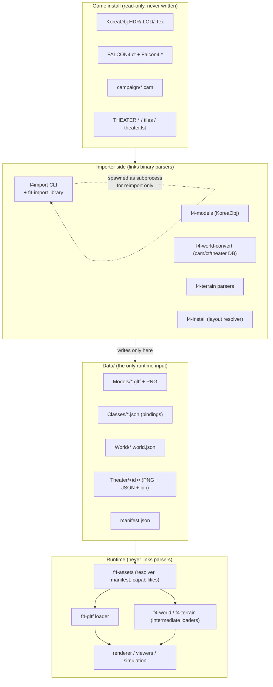
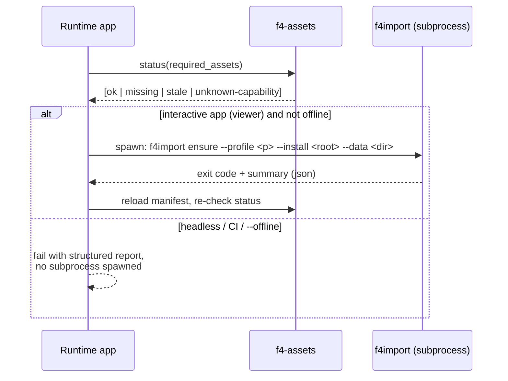

# Asset Pipeline & Runtime Isolation Specification

Status: **Draft v1** — design agreed in discussion, not yet implemented.
Related documents: `ARCHITECTURE PROPOSAL.md` (§6, §14 — build-time conversion for
aircraft data), `FALCON4_FILE_LAYOUT.md` (on-disk game layout reference).

This document specifies how game data moves from a Falcon install into the `Data/`
tree, how assets are identified, tagged, bound, and validated, and how the runtime
(viewers, simulation player, renderer) is kept **completely isolated** from the
importers and from the legacy binary formats.

Three source domains are covered throughout:

| Domain | Game sources |
|---|---|
| **Models** | `KoreaObj.HDR/.LOD/.Tex` (+ `.DXH/.DXL` where present) |
| **Campaign / world** | `campaign/*.cam`, class table `FALCON4.ct`, theater object DB `Falcon4.*` |
| **Terrain / theater** | `theater.lst`, `theater.ini`, `THEATER.MAP/.MEA/.O2`, `THEATER.O<N>/.L<N>`, `TEXTURE.BIN`, `texture.zip`, `FArtILES.PAL/.RAW` |

---

## Table of Contents

1. [Principles](#1-principles)
2. [Isolation Architecture](#2-isolation-architecture)
3. [Source Domains and Their Intermediates](#3-source-domains-and-their-intermediates)
4. [Data Directory Layout](#4-data-directory-layout)
5. [Asset Identity and Addressing](#5-asset-identity-and-addressing)
6. [glTF Node Tagging Specification](#6-gltf-node-tagging-specification)
7. [Binding Tables and Provenance](#7-binding-tables-and-provenance)
8. [Runtime Asset Access — f4-assets](#8-runtime-asset-access--f4-assets)
9. [The f4import CLI and doctor Validation](#9-the-f4import-cli-and-doctor-validation)
10. [CMake Boundary Enforcement](#10-cmake-boundary-enforcement)
11. [Library Re-Homing Map](#11-library-re-homing-map)
12. [Migration Plan](#12-migration-plan)
13. [Open Questions](#13-open-questions)
- [Appendix A — Airbase 2, end to end](#appendix-a--airbase-2-end-to-end)
- [Appendix B — Example manifest.json](#appendix-b--example-manifestjson)

---

## 1. Principles

These are the invariants the rest of the document is built on. Every design
decision below can be traced back to one of these.

**P1 — One-way data flow.**
Game install (read-only) → importers → `Data/` → runtime. Data never flows
backwards: the runtime never writes into `Data/`, importers never write into the
game install, and the game install is never mutated by anything.

**P2 — Link-time isolation.**
Only importer targets may link the legacy binary parsers. Runtime targets are
physically incapable of touching game formats because the parser libraries are
absent from their transitive link closure (enforced in CMake, §10). This is a
hard rule, not a convention.

**P3 — Process isolation for reimport.**
The runtime may *detect* missing or stale assets, and may *orchestrate* a
reimport by spawning the `f4import` binary as a subprocess — but it never links
importer code. CI and headless runs disable subprocess spawning entirely
(offline mode) and fail with structured reports instead.

**P4 — Assets don't know their roles; references do.**
An asset records what was *observed* to reference it (`used_by`), but role
semantics (entity art vs feature art vs both) are declared by the load profile
the consumer requests, backed by binding tables. No heuristics like
`ModelRecord::visual_class()` guessing air/ground/feature from slot counts.

**P5 — Absence must be unambiguous.**
Every capability of an asset is in exactly one of three states: **present**,
**none** (the authoritative source was consulted and says there is none), or
**unknown** (the authoritative source was never consulted at export time). The
runtime treats `none` and `unknown` differently; nothing may silently degrade
`unknown` into `none`.

**P6 — Stable logical identity.**
Assets are addressed by stable IDs derived from source identity (e.g.
`koreaobj:00002`, `theater:korea`), never by source file paths or hard-coded
install conventions. All consumers resolve through the same resolver.

**P7 — The manifest is the contract.**
`Data/manifest.json` records every asset, its sources with content hashes, the
importer version, and its capabilities. Staleness is judged by hash comparison,
never by file existence alone.

---

## 2. Isolation Architecture

### 2.1 The boundary



### 2.2 What the runtime may and may not know

| Runtime **may** know | Runtime **must not** know |
|---|---|
| `Data/` directory layout (§4) | KoreaObj HDR/LOD/TEX/BSP binary layout |
| `manifest.json` schema | `THEATER.*`, `TEXTURE.BIN`, `FArtILES` binary layout |
| Asset ID grammar (§5) | `.cam` container / LZSS campaign layout |
| glTF 2.0 + the `f4` extras schema (§6) | `FALCON4.ct` / `Falcon4.*` binary layout |
| Binding-table JSON schemas (§7) | Install directory conventions (`terrdata/`, `sim/`, `campaign/SAVE/`…) |
| The *existence* of an install root path | Any CWD-relative fallbacks (`temp/`, `assets/`, test fixtures) |

The right-hand column is, today, spread across the runtime: `f4-simulation`
links `f4-world-convert` for `ClassTable`, `f4-renderer` links it PUBLIC, the
renderer consumes raw `THEATER.*` via `f4-terrain`, and `f4-install` carries
CWD fallbacks like `"../../temp/FALCON4.ct"` (`installation.cpp:264-272`).
Closing that gap is the point of this document.

### 2.3 Reimport flow (process-isolated)



Rules:

- The runtime links only `f4-assets` (manifest reader, capability checker). The
  subprocess boundary keeps parser code out of the link closure even though the
  viewer can trigger imports interactively.
- Offline mode (`--offline` flag or `F4_OFFLINE=1` env) is the default for
  tests and CI: no spawning, ever; failures are reports, not attempts.
- `f4import` itself is idempotent and safe to run concurrently with a running
  viewer: it writes new files first and atomically renames, then rewrites
  `manifest.json` last.

---

## 3. Source Domains and Their Intermediates

### 3.1 Overview

| Domain | Game sources | Importer module | Intermediate outputs | Runtime consumers |
|---|---|---|---|---|
| Models | `KoreaObj.HDR/.LOD/.Tex` | `f4import models` | `Models/koreaobj/NNNNN.gltf`, `Models/koreaobj/textures/*.png` | `f4-gltf` → renderer, viewers, sim visuals |
| Classes & bindings | `FALCON4.ct`, `Falcon4.PHD/PD/OCD/UCD/VCD/…` | `f4import classes` | `Classes/falcon4.ct.json`, `Classes/visual_bindings.json`, `Classes/objective_layouts.json` | `f4-world`, `f4-simulation`, ground layout |
| Campaign / world | `campaign/*.cam` | `f4import campaign` | `World/<campaign-id>.world.json` | `f4-world::WorldState` |
| Terrain / theater | `theater.lst`, `theater.ini`, `THEATER.*`, post levels, tile art | `f4import terrain` | `Theater/<theater-id>/…` (§3.5) | `f4-terrain` (runtime loader), renderer `WorldView` |

### 3.2 Models domain

The KoreaObj BSP tree is the model's node hierarchy (`BSubTree`, `BDofNode`,
`BXDofNode`, `BTransNode`, `BScaleNode`, switch nodes, geometry nodes) — it
converts structurally to glTF, with nothing left over that needs a sidecar
format:

| KoreaObj element | glTF mapping |
|---|---|
| `BSubTree` | node with children |
| geometry node (coords/normals/uv/rgba/tex_ids) | mesh node |
| `BDofNode` / `BXDofNode` | named node; min/max/multiplier/flags → node `extras` (§6) |
| switch node (selects child variant) | node with N children; runtime toggles child visibility |
| `BTransNode` / `BScaleNode` | named transform node |
| LOD chain | per-LOD mesh nodes tagged `lod:N` (§6.5) |

Key exporter decisions:

- **B-splines tessellate at export.** glTF is triangle-based; runtime spline
  tessellation is out of scope for an engine-agnostic runtime.
- **`.gltf` + external PNG textures, not `.glb`.** `KoreaObj.Tex` is a shared
  texture archive — thousands of models reference a much smaller set of shared
  pages. External textures in `Models/koreaobj/textures/` avoid duplicating the
  archive inside every model file. (Blender handles external textures fine;
  users may pack for transport.)
- **Units and axes convert at export.** glTF is meters, +Y up; Falcon model
  space is feet, +Z up. The exporter bakes the transform so the runtime never
  needs Falcon-specific coordinate conventions.
- **Untagged DOFs are not lost.** Any DOF without a rosetta mapping becomes
  `dof:unknown.N` with its index recorded in extras — recoverable, annotatable
  in Blender, never dropped.
- **Far-LOD billboards** (authored cards in low LODs) are exported as ordinary
  `lod:N` mesh nodes with an extras flag; the runtime may render them as
  billboards or ignore them, but the data survives.

### 3.3 Classes & bindings domain

`FALCON4.ct` and the theater object DB are not art — they are **reference
data**. They are converted to JSON tables that the runtime joins at load time
(§7). Nothing from this domain is baked into model files; the relationship data
stays relational so that "who uses this model?" is always answerable from the
binding tables alone.

Outputs:

- `Classes/falcon4.ct.json` — the class table, one entry per class: `domain`,
  `cls`, `type`, `stype`, `vis_type[7]` (as asset IDs, not raw indices), plus
  any decoded per-class payloads currently parsed.
- `Classes/visual_bindings.json` — the reverse index: per model asset, which
  classes reference it (primary/alternate/damage slots). Materialized from the
  observed `vis_type[]` references at export.
- `Classes/objective_layouts.json` — per objective *type*: feature lists
  (`FeatureEntryData`: class index, offsets, facing, value) from the theater
  DB. Per-instance placement of features stays in world JSON; this file holds
  only the type-level template.

### 3.4 Campaign / world domain

`.cam` → world JSON is the mature pipeline; the changes are locational and
referential:

- Output moves from "next to the `.cam`" to `World/<campaign-id>.world.json`.
- `terrain_file` references (currently bare filenames resolved next to the
  JSON) become **asset IDs** (`theater:korea`) resolved through the manifest.
- Model references inside world state (`vis_type[0]` lookups) become asset IDs
  resolved through `Classes/visual_bindings.json`.
- Undecoded `.cam` sub-files (`.pilot/.victory/.oob`) remain base64 opaque
  sidecars inside the world JSON, marked `"decoded": false` — the established
  pattern. When a parser lands, the importer upgrades them and bumps the
  format version; the runtime never needs to care.

### 3.5 Terrain / theater domain

| Source | Intermediate | Notes |
|---|---|---|
| `THEATER.MAP` (tile-type grid) | `Theater/<id>/map.png` | indexed 8-bit PNG; palette = tile type index; trivially inspectable in any image viewer |
| `THEATER.MEA` (elevation) | `Theater/<id>/elevation.png` | 16-bit grayscale PNG |
| `THEATER.O2` | `Theater/<id>/o2.png` or JSON+bin | per current parser semantics; keep lossless |
| `THEATER.O<N>` / `THEATER.L<N>` post levels | `Theater/<id>/posts/<N>.json` + `<N>.bin` | JSON header (dims, format, version) + raw binary payload — pure-JSON does not scale to post-level sizes |
| `TEXTURE.BIN` + `texture.zip` / loose `*.pcx` | `Theater/<id>/tiles/near/*.png` + `tiles/near.json` | decode STORED zip / PCX once at import; runtime gets plain PNGs |
| `FArtILES.PAL/.RAW` far tiles | `Theater/<id>/tiles/far/*.png` + `tiles/far.json` | palette applied at import |
| `theater.lst`, `theater.ini` | `Theater/theaters.json` | theater registry: id, title, source dir hash |

The runtime `f4-terrain` slims down to a loader for these intermediates; every
binary-format parser (post levels, near/far tile DBs, case-insensitive
`file_util.hpp` probing) migrates to the importer side.

---

## 4. Data Directory Layout

```
Data/
├── manifest.json                 # asset registry + provenance (§7.3, §8)
├── Classes/
│   ├── falcon4.ct.json           # class table (typed JSON)
│   ├── visual_bindings.json      # model ↔ class reverse index
│   ├── objective_layouts.json    # per objective-type feature templates
│   └── dof_tags.json             # tag vocabulary registry (§6.7)
├── Models/
│   └── koreaobj/
│       ├── 00001.gltf … 0NNNN.gltf
│       └── textures/             # shared PNG pages extracted from KoreaObj.Tex
├── World/
│   └── <campaign-id>.world.json
├── Theater/
│   ├── theaters.json
│   └── korea/
│       ├── map.png
│       ├── elevation.png
│       ├── posts/0000.json + 0000.bin …
│       ├── tiles/
│       │   ├── near.json + near/NNN.png
│       │   └── far.json  + far/NNN.png
│       └── theater.json          # remaining theater metadata (title, dims)
├── Aircraft/
│   └── f16.json                  # already produced by dat2json (f4-convert)
└── Scenarios/
    └── *.scenario.json           # relocatable — reference assets by ID
```

Layout rules:

- **One directory per domain, subdirectory per source family.** The source
  family name (`koreaobj`) keeps the door open for BMS or other art sets
  (`Models/bms/…`) without renaming collisions.
- **`Data/` is generated, not committed.** It is gitignored in full. The repo
  carries synthetic test fixtures instead (see §12, Stage 0). This also removes
  the ~38 MB of game bytes currently committed under `temp/` and test fixture
  directories — derived-from-game artifacts do not belong in the public repo.
- **Scenario JSONs reference logical IDs** (`"@asset:theater:korea"`), never
  absolute paths. This retires the `configure_file`-baked
  `@F4_SOURCE_DIR@`/`@F4_BINARY_DIR@` absolutes in `f4-scenario-player/scenarios/*.json.in`
  and makes scenarios relocatable between machines.

---

## 5. Asset Identity and Addressing

### 5.1 Asset ID grammar

```
<family>:<local-id>
```

| Family | Local ID source | Examples |
|---|---|---|
| `koreaobj` | KoreaObj model index, zero-padded 5 | `koreaobj:00042` |
| `class` | class table index | `class:171` |
| `theater` | theater ID from `theater.lst`/`theater.ini` (lowercased) | `theater:korea` |
| `campaign` | campaign save id (stem of `.cam`, lowercased) | `campaign:save1` |
| `aircraft` | aircraft data name (existing f4-data ids) | `aircraft:f16` |
| `tileset` | theater + near/far | `tileset:korea.near` |

Rules:

- **IDs are stable across reimports** and independent of install location,
  file case, and directory naming. The same ID must always resolve to the same
  logical asset; content changes are tracked by the manifest, not the ID.
- **IDs are lowercase**; local IDs use `[a-z0-9._-]` only. No spaces.
- **The zero-padded numeric form** (`koreaobj:00042`) preserves sort order and
  keeps Blender/manual browsing sane; the file on disk is
  `Models/koreaobj/00042.gltf`.
- `theater:korea` is the *source-derived* theater ID. If a second ecosystem
  (BMS) is imported later, its family prefix disambiguates (`theater:bms-korea`
  or a `Models/bms/` family) — the namespace decision is deferred (§13) but the
  grammar already supports it.

### 5.2 Resolution

Every consumer resolves IDs through `f4-assets` (§8). Nothing in the runtime
constructs paths by joining strings. The manifest maps `id → path` and
`id → sources[]`; the resolver is the only component that knows the mapping
rules.

---

## 6. glTF Node Tagging Specification

This section is the contract between the exporter, Blender users, and the
runtime. It is deliberately small: a naming grammar, an extras schema, and a
vocabulary registry.

### 6.1 Node naming grammar

```
<kind>:<id>[.<instance>]
```

`kind` is one of the reserved kinds below. `id` is lowercase snake_case.
`instance` is a numeric or short-alphanumeric disambiguator (`.1`, `.l`,
`.a03`). Examples:

| Kind | Meaning | Examples |
|---|---|---|
| `dof` | runtime-driven degree of freedom | `dof:gear`, `dof:flap.l`, `dof:rotor.main`, `dof:unknown.7` |
| `sw` | switch (selects child variant) | `sw:hook`, children `sw:hook.0`, `sw:hook.1` |
| `slot` | attachment point (stores, hardpoints) | `slot:pylon.l`, `slot:wingtip.r` |
| `anchor` | spatial feature anchor (empty node) | `anchor:parking.3`, `anchor:runway`, `anchor:taxi.a03` |
| `lod` | mesh variant level | `lod:0` (best) … `lod:N` |
| `col` | collision proxy hull (optional, user-authored) | `col:hull.1` |

Reserved prefixes only — any node without a reserved prefix is ordinary scene
content and is ignored by the runtime resolution pass (but preserved in the
file).

Why `kind:id` rather than `DOF_Gear`-style prefixes: the colon survives
Blender's namespace flattening, greps cleanly, is trivially parseable, and
keeps the human-readable id separate from the machine kind. (Users who prefer
`DOF_Gear` can keep working names in Blender; the exporter and runtime only
require the grammar in the *exported* glTF. The Blender-side convention is a
recommendation, not a constraint.)

### 6.2 The `f4` extras object

Every tagged node carries structured metadata in glTF node `extras` under a
single `f4` key (glTF's designed extensibility point; Blender imports node
extras as custom properties and re-exports them — the round trip is native):

```json
{ "name": "dof:gear",
  "extras": { "f4": {
      "v": 1,
      "kind": "dof",
      "id": "gear",
      "index": 7,
      "min": 0.0, "max": 1.57, "mult": 1.0, "flags": 0
  } } }
```

Common fields (all kinds): `v` (schema version), `kind`, `id`.
Kind-specific fields:

- `dof`: `index` (original KoreaObj DOF index — provenance, kept forever),
  `min`, `max`, `mult`, `flags` (verbatim from `BXDofNode`).
- `sw`: `index` (original switch index); children carry `child` (original
  child number) and optional `state` hint (`"up"`, `"down"`, `"open"`…).
- `slot`: `index`, optional `station` (weapon station id from class data).
- `anchor`: kind-specific payload — e.g. `anchor:runway` carries
  `{"length_m":…, "width_m":…, "heading_deg":…}`; `anchor:taxi.*` carries
  `{"chain":"a","order":3}` for chain sequencing; `anchor:parking.*` carries
  `{"spot":3,"type":"hangar|apron"}`.
- `lod`: `level` (0 = highest detail).
- `col`: `shape: "hull"`, optional `material` hint.

Parsers must accept and preserve unknown fields inside `f4` — forward
compatibility is mandatory, and community-authored metadata must survive
round trips even when the runtime does not understand it.

### 6.3 DOF semantics at runtime

- Per **model**: one-time tag resolution at load — build
  `map<tag, node_handle>` from all `dof:`/`sw:`/`slot:` nodes. Shared across
  instances.
- Per **instance**: animated values (`dof value`, `switch active child`) live
  in the entity's model state, keyed by tag.
- Simulation code animates by tag: `if (auto* gear = dofs.find("gear")) …`.
  Missing tag = part absent = no-op. No magic indices.

### 6.4 Switches

A Falcon switch node selects among child subtree variants. Mapping: all
children are exported as child nodes of the `sw:` node; the runtime activates
exactly one by setting child visibility (glTF node `visibility` in
`f4`-managed state, not by mutating the node graph). Switch-driven *texture*
swaps (rare, loadout skins) are the material-variant open question (§13).

### 6.5 LODs

Authored Falcon LODs export as sibling mesh nodes named `lod:N` under the
model root, each with extras `{"level": N}`. The renderer picks by distance.
Far-LOD billboards carry `{"billboard": true}` and may be rendered as cards.
Runtime generation of intermediate LODs (meshoptimizer) is a later,
independent addition — authored variants are kept because they are free data
and low LODs are not always strict simplifications.

### 6.6 Blender workflow

- Node names: edit in the outliner — grammar is plain text.
- Extras: imported as custom properties; edit in the N-panel → Custom
  Properties; exported back to glTF automatically.
- Anchors (`anchor:*`) are empties: users add parking spots, taxi chains, and
  runway markers by placing named empties. No custom Blender tooling is
  required for v1; an add-on later can add validation and palette tools.

### 6.7 Tag vocabulary registry

`Data/Classes/dof_tags.json` (versioned in the repo under `f4-import/vocab/`,
copied into `Data/` at import) lists the well-known tags with descriptions:

```json
{ "f4": { "v": 1 },
  "dof":  { "gear": "landing gear assembly", "flap.l": "left flap",
             "rotor.main": "main rotor", "boom": "refueling boom", … },
  "sw":   { "hook": "tailhook up/down", "canopy": "canopy open/closed", … },
  "anchor": { "parking": "airbase parking spot", "runway": "runway footprint",
               "taxi": "taxi waypoint chain" } }
```

Conventions: lowercase snake_case; `.l`/`.r` suffixes for mirrored parts;
`dof:unknown.N` reserved for unmapped indices. The registry is advisory —
unknown tags in assets are preserved and linted as warnings by `doctor`
(D6), never errors. Community additions require only a registry entry, no
runtime changes.

---

## 7. Binding Tables and Provenance

### 7.1 `Classes/visual_bindings.json`

Materialized from observed `vis_type[]` references in `FALCON4.ct`
(`class_table.hpp:176-182`) — the reverse of the class table:

```json
{ "f4": { "v": 1 },
  "sources": [ { "path": "FALCON4.ct", "sha256": "…" } ],
  "models": {
    "koreaobj:00002": {
      "used_by_classes": [
        { "class": 171, "slot": "primary" },
        { "class": 204, "slot": "alternate.1" }
      ],
      "used_by_features": [ "airbase" ]
    }
  } }
```

`used_by_features` records objective-type families observed referencing the
model through class indirection. This replaces the `visual_class()` slot-count
heuristic with recorded fact: role is declared by references, and the
references are data.

### 7.2 Join discipline (exporter)

One pass over all sources, joining on the model index as primary key:

```
for model_index in 0 .. HDR.count:
    art      <- parse_bsp_lods(model_index)          # f4-models parser (importer side)
    tags     <- rosetta.dof_map[model_index] or {}   # extracted from FreeFalcon source
    classes  <- ct.references_to(model_index)         # vis_type[] scan
    features <- theater_db.references_to(classes)
    write Models/koreaobj/000NN.gltf (art + tags + used_by + provenance)
emit Classes/visual_bindings.json
emit Classes/falcon4.ct.json, Classes/objective_layouts.json
update manifest.json
```

- Models referenced by nothing are still exported (orphans are informational
  for `doctor`, D7 — they may become referenced by future content).
- `vis_type[k] == 0` means "no model for this slot" and is recorded as such —
  never silently skipped.
- Class table and theater DB observations are **different namespaces**; if
  they disagree, both are recorded. The exporter never merges conflicting
  claims into one "truth".

### 7.3 `manifest.json` and provenance

Every asset gets a provenance record. The `sources[]` list is what makes
staleness checks (hash comparison) and the three-state capability model (P5)
possible:

```json
{ "id": "koreaobj:00002",
  "path": "Models/koreaobj/00002.gltf",
  "format_version": 1,
  "importer": { "name": "f4import", "version": "0.4.0" },
  "sources": [
    { "path": "terrdata/objects/KoreaObj.HDR", "role": "art",    "sha256": "…" },
    { "path": "terrdata/objects/KoreaObj.LOD", "role": "art",    "sha256": "…" },
    { "path": "terrdata/objects/KoreaObj.Tex", "role": "art",    "sha256": "…" },
    { "path": "FALCON4.ct",                    "role": "classes","sha256": "…" },
    { "path": "terrdata/objects/Falcon4.PHD",  "role": "theater","sha256": "…" }
  ],
  "capabilities": {
    "dofs":    { "status": "present", "count": 9 },
    "switches":{ "status": "present", "count": 14 },
    "anchors": { "status": "unknown" },
    "slots":   { "status": "present", "count": 0 }
  } }
```

### 7.4 The three-state capability model

| Status | Meaning | Runtime behavior |
|---|---|---|
| `present` | source consulted; data exists (payload in `detail`) | consume it |
| `none` | source consulted; authoritative source says there is none | treat as genuinely absent |
| `unknown` | the source that would know was **not consulted** at export | treat as missing-capability error when required; never assume `none` |

Derivation rule: a capability may only be `present` or `none` if every
authoritative source for it appears in `sources[]`. `f4import` enforces this
at write time (it cannot claim `none` without having read the theater DB);
`doctor` (D4) re-verifies it.

This is what disambiguates "this airbase has no parking data" from "this
export never had the chance to know."

---

## 8. Runtime Asset Access — f4-assets

A small runtime library (no parser dependencies, links only `f4-json`) that is
the **only** way runtime code touches `Data/`.

### 8.1 Asset root resolution

Precedence: `--data-dir` CLI flag → `F4_DATA_DIR` env → `./Data` next to the
executable → `./Data` in the repo checkout. Resolved once, logged at startup.

### 8.2 Load profiles

Loaders declare what they need instead of guessing:

```cpp
// Geometry-only profile (models-viewer, VisualModelComponent)
ModelAsset a = assets.load<ModelAsset>("koreaobj:00002");

// World-feature profile (ground layout, sim world spawn) — requires anchors
FeatureAsset f = assets.load<FeatureAsset>("koreaobj:00002");
// FeatureAsset::anchors() -> span<Anchor>, FeatureAsset::bindings() -> …
```

`load<FeatureAsset>` on an asset whose capability is `none` returns an asset
with empty anchors (legitimately none). On `unknown`, it returns
`error::missing_capability` naming the reimport command that fixes it. Same
file, different contracts — the distinction between "as a model" and "as a
feature" is a load profile, backed by capability state, not a heuristic.

### 8.3 Status and staleness API

```cpp
enum class AssetStatus { ok, missing, stale, unknown_capability };

struct AssetReport { AssetId id; AssetStatus status; std::string detail; };

// Check a declared requirement set (app-specific):
std::vector<AssetReport> r = assets.check({
    RequiredAsset::model ("koreaobj:00002"),        // geometry must exist
    RequiredAsset::theater("theater:korea"),
    RequiredAsset::world ("campaign:save1"),
    RequiredAsset::feature("koreaobj:00002"),       // + anchors capability
});
```

Staleness rule (P7): `stale` when any `sources[].sha256` differs from the
current install file's hash, when `format_version` or importer version is
older than the current policy, or when the file listed in the manifest is
absent. Existence alone is never evidence of freshness.

### 8.4 Reimport orchestration

Interactive apps may offer "fix it now": spawn
`f4import ensure --profile <p> --install <root> --data <data-dir>` as a
subprocess (P3), wait, reload the manifest, re-check. Headless contexts run
with `--offline` and surface the report instead. The install root, if known,
is passed through; runtime code never derives install paths itself.

---

## 9. The f4import CLI and doctor Validation

### 9.1 CLI surface

```
f4import import  --install <root> --data <dir> [--profile full|models|classes|campaign|terrain]
f4import check   --data <dir>  [--install <root>] [--profile …] [--json]
f4import ensure  --install <root> --data <dir> [--profile …] [--json]
f4import doctor  --data <dir> [--json]
```

- `import` — unconditionally (re)import the requested profile.
- `check` — status only; exit `0` ok, `1` missing/stale, `2` structural error.
  CI-runnable without an install (validates manifest-internal consistency only
  when `--install` is omitted).
- `ensure` — `check` + import exactly what is missing/stale. Idempotent.
- `doctor` — full validation suite below; exit `0` clean, `1` errors, `2`
  warnings only.

### 9.2 doctor checks

| # | Check | Severity |
|---|---|---|
| D1 | Every binding in `visual_bindings.json` resolves to an existing asset | error |
| D2 | Every world JSON model/class reference resolves through bindings | error |
| D3 | Every `vis_type[k] != 0` in `falcon4.ct.json` has a binding entry | error |
| D4 | Capability statuses are justified by `sources[]` (no `none` without the authoritative source) | error |
| D5 | Node tags conform to the §6 grammar; kind-specific extras present | error |
| D6 | Tags used in assets but absent from the vocabulary registry | warning |
| D7 | Orphan assets (not referenced by any binding or world) | info |
| D8 | ID collisions, case collisions, unlisted files in `Data/` | error / warning |
| D9 | Manifest internal consistency (listed files exist; hashes parse; versions sane) | error |

`doctor` runs in CI against a small synthetic `Data/` tree so the validation
logic itself is regression-tested without a game install.

---

## 10. CMake Boundary Enforcement

P2 is enforced mechanically, not by review:

```cmake
# Every f4-* target declares its side of the boundary.
set_target_properties(f4-world-convert f4-terrain-convert f4-models
                      f4-install f4-convert f4-import
                      PROPERTIES F4_SIDE importer)
set_target_properties(f4-assets f4-world f4-terrain f4-renderer
                      f4-simulation f4-gltf
                      PROPERTIES F4_SIDE runtime)
# Neutral: f4-math f4-geo f4-units f4-io f4-lzss f4-json f4-entities … (no property)
```

`cmake/verify_boundary.cmake` (run as a test / CI step):

1. For every app and runtime target, walk the transitive link closure and fail
   if it contains an `F4_SIDE importer` target. Today this check would fail on
   `f4-simulation` (links `f4-world-convert`, `f4-simulation/CMakeLists.txt:64-66`)
   and `f4-renderer` (links it PUBLIC) — which is precisely the list of
   violations the migration plan removes, and afterwards the check keeps it
   removed.
2. Lint: runtime sources must not include headers under `f4/import/` or the
   parser libs' include dirs (a `rg`-based CI check; importer headers live
   under a dedicated prefix to make this greppable).

---

## 11. Library Re-Homing Map

| Library | Side | Change |
|---|---|---|
| `f4-import` (new) | importer | Orchestrator: profiles, manifest writing, binding emitters, `f4import` CLI, doctor |
| `f4-gltf` (new) | runtime | Minimal glTF 2.0 loader (vendored header-only: tinygltf or fastgltf) + `f4` extras reader |
| `f4-assets` (new) | runtime | Root resolution, manifest/capability checks, load profiles, status API |
| `f4-models` | importer-only | KoreaObj HDR/LOD/TEX/BSP parsing migrates here; runtime consumers switch to `f4-gltf` |
| `f4-world-convert` | importer-only | `.cam`/ct/theater-DB parsing + world JSON emission; no runtime links |
| `f4-terrain` | split | Binary parsers (THEATER.*, tile DBs, post levels) → importer; JSON+PNG runtime loader stays |
| `f4-terrain-convert` | importer-only | Thin wrapper as today, now writing the §3.5 outputs |
| `f4-install` | importer-only | Sole resolver of install layout; CWD fallbacks deleted; duplicated finders folded in |
| `f4-convert` | importer-only | Aircraft `.dat` → JSON as today |
| `f4-world` | runtime | Unchanged contract (world JSON in), plus binding-table joins |
| `f4-io`, `f4-lzss`, `f4-json`, `f4-math`, `f4-geo`, `f4-units` | neutral | Format-agnostic; usable on both sides |
| `f4-renderer`, `f4-simulation`, viewers | runtime | Drop all parser links; load via `f4-assets`/`f4-gltf`/`f4-terrain` |

---

## 12. Migration Plan

Each stage is shippable and leaves the tree working. "Deletes" lists the
specific debt each stage retires.

**Stage 0 — Freeze the contracts (this spec).**
Define asset ID grammar, manifest schema v1, tag grammar, vocabulary file.
Add `f4-import` skeleton with `check`/`doctor` only. Gitignore `Data/`; plan
removal of committed game bytes (`temp/`, binary fixtures) in favor of
synthetic fixtures (a `test_synthetic.dat` pattern already exists).
*Deletes: nothing yet, but stops new debt.*

**Stage 1 — Redirect outputs into `Data/`.**
Viewer/CLI conversion outputs move from "next to the `.cam`" and "into the
theater dir" (`install_flow.cpp:231,313`, `file_ops.cpp:142-186`) into `Data/`;
manifest v1 is written; world JSON `terrain_file` refs become asset IDs.
*Deletes: runtime writes into the game install; bare-filename terrain refs;
the hard-coded `"korea"` in `file_ops.cpp:143,151-152`.*

**Stage 2 — Centralize resolution.**
`f4-install` folds in the duplicated finders (`theater_data.cpp:169-229`,
`f4-terrain/file_util.hpp`, `model_database.cpp:354-420` name-variant arrays)
and deletes the CWD fallback list (`installation.cpp:264-272`). Scenario JSONs
switch from `@F4_SOURCE_DIR@` absolutes to asset IDs.
*Deletes: 4 duplicated case-insensitive finders; 4 ct-resolution variants;
non-relocatable scenarios.*

**Stage 3 — Models to glTF.**
`f4import models` (tessellation + tagging via `extract_dofs.py` rosetta map);
renderer and viewers load via `f4-gltf`; `f4-models` leaves the runtime link
closure. Fallback ladder: tag → rosetta index → raw index keeps untagged art
animating during the transition.
*Deletes: KoreaObj as a runtime format; the `simulation.cpp:245-249`-style
magic switch/DOF indices; `visual_class()` heuristics (replaced by
`used_by` data).*

**Stage 4 — Terrain to PNG/bin.**
`f4import terrain`; `f4-terrain` slims to the runtime loader; renderer's raw
binary path (`WorldView::load_theater` dual-convention probing,
`world_view.cpp:22-33`) retires.
*Deletes: the two-conflicting-theater-dir-convention problem; raw tile binary
parsing at runtime.*

**Stage 5 — Enforce the boundary.**
Add `F4_SIDE` properties + `verify_boundary.cmake` to CI; `f4-simulation`
drops its `f4-world-convert` link (ClassTable via `falcon4.ct.json` +
bindings through `f4-assets`); `f4-renderer` drops it too.
*Deletes: the last runtime→parser links; the boundary violation class as a
whole.*

---

## 13. Open Questions

1. **Switch-driven texture swaps** — Falcon switches occasionally change
   materials, not just geometry. Candidates: `KHR_materials_variants` with
   `sw:`-linked variant names, or duplicate meshes. Decide when a concrete
   model needs it.
2. **BMS / second-ecosystem namespaces** — `Models/bms/`+`theater:bms-korea`
   vs per-ecosystem `Data/` roots. Deferred until a BMS import is attempted;
   the ID grammar supports either.
3. **Collision proxies** — user-authored `col:hull.*` meshes first;
   generated convex decomposition (V-HACD) at import as a later option.
4. **Slot→weapon binding depth** — whether `slot:` extras should carry
   weapon-station assignments from class data now or stay pure anchors until
   the stores model lands.
5. **Far-LOD billboards in f4-renderer** — render as cards or drop at v1
   (data is preserved either way).

---

## Appendix A — Airbase 2, end to end

Sources: `FALCON4.ct` class 171 (`vis_type[0] = 2`), theater DB objective
family "airbase" with `FeatureEntryData {index: 171, offset: (120,-40,0),
facing: 90}`, campaign `save1.cam` placing an airbase-2 instance at a world
position.

**Export** (one pass): model index 2 → `Models/koreaobj/00002.gltf` with
`dof:`/`sw:` nodes tagged from the rosetta map, `anchor:parking.1..12`
empties (if the theater DB join was available), provenance listing HDR/LOD/
Tex + ct + PHD hashes, capabilities `{dofs: present, anchors: present}`.
Bindings: `visual_bindings.json` records class 171 → `koreaobj:00002`
(primary); `objective_layouts.json` records the airbase-2 feature template
(offsets/facing per feature entry).

**Load as a model** (models-viewer / entity visual): `ModelAsset` for
`koreaobj:00002` — geometry, DOF machinery, LOD variants. No bindings needed.
Instance drives `dof("gear")` by tag.

**Load as a feature** (world-viewer / sim spawn): world JSON's airbase
instance → feature template in `objective_layouts.json` → per-feature class
→ `visual_bindings.json` → `koreaobj:00002` → `FeatureAsset` (anchors
present) → compose local anchors × instance transform from the world JSON.

**Failure modes, loudly:**

- Model 47 referenced by a binding but never exported → D1 error:
  `binding class:204 → koreaobj:00047: asset missing — run 'f4import models --install …'`.
- Export ran without the theater DB → capabilities say `anchors: unknown`;
  `load<FeatureAsset>` fails with `missing_capability` naming the reimport
  command; `check --profile full` reports it *before* any app loads. The
  model still loads fine as a `ModelAsset` — the failure is profile-scoped.

## Appendix B — Example manifest.json

```json
{ "f4": { "v": 1, "generator": "f4import 0.4.0" },
  "data_dir": "Data/",
  "assets": [
    { "id": "koreaobj:00002", "path": "Models/koreaobj/00002.gltf",
      "format_version": 1, "capabilities": { "dofs": {"status":"present","count":9},
      "anchors": {"status":"present","count":12} },
      "sources": [ { "path": "terrdata/objects/KoreaObj.HDR", "role": "art", "sha256": "…" },
                    { "path": "FALCON4.ct", "role": "classes", "sha256": "…" },
                    { "path": "terrdata/objects/Falcon4.PHD", "role": "theater", "sha256": "…" } ] },
    { "id": "theater:korea", "path": "Theater/korea/theater.json",
      "format_version": 1,
      "capabilities": { "map": {"status":"present"}, "posts": {"status":"present","levels":8},
                         "tiles_near": {"status":"present"}, "tiles_far": {"status":"none"} },
      "sources": [ { "path": "terrdata/korea/theater/theater.lst", "role": "theater", "sha256": "…" },
                    { "path": "terrdata/korea/theater/THEATER.MAP", "role": "theater", "sha256": "…" } ] },
    { "id": "campaign:save1", "path": "World/save1.world.json",
      "format_version": 1,
      "capabilities": { "objectives": {"status":"present","count":214},
                         "pilot_files": {"status":"unknown"} },
      "sources": [ { "path": "campaign/SAVE/save1.cam", "role": "campaign", "sha256": "…" } ] }
  ] }
```
